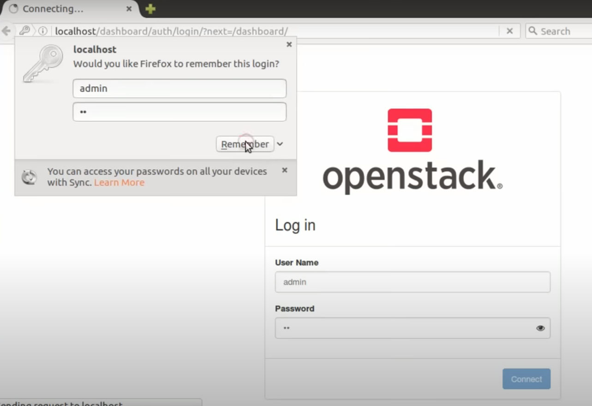

## Catatan :
Dalam pengerjaan praktikum ini menggunakan VDI Ubuntu 22.0.4 LTS karena, Versi Ubuntu 18.0.4 LTS sudah tidak direkomendasikan lagi, dan lebih disarankan menggunakan Ubuntu 22.0.4 yang support hingga tahun 2027 mendatang. 

Proses penginstallan juga melibatkan aplikasi [gParted](https://sourceforge.net/projects/gparted/) untuk membagi partisi `/boot` di Linux, Tata cara pembagian partisi bisa dilihat [disini](https://itsfoss.com/increase-disk-size-virtualbox/).


Lakukan update sistem :
```
sudo apt update && sudo apt upgrade -y
```

Selanjutnya buat user baru dengan nama `stack`.  
```
sudo useradd -s /bin/bash -d /opt/stack -m stack
```

Pastikan stack sebagai user root : 
```
echo "stack ALL=(ALL) NOPASSWD: ALL" | sudo tee /etc/sudoers.d/stack
```

Pindah ke user stack :
```
sudo su - stack
```

Install python3 pip :
```
sudo get-apt python3-pip -y
```

Install git :
```
sudo apt install git
```

Clone repository github devstack :
```
git clone https://opendev.org/openstack/devstack
```

Buka directory devstack & membuka file knfigurasi :
```
cd devstack
nano local.conf
```

Membuat konfigurasi password :
```
ADMIN_PASSWORD=secret
DATABASE_PASSWORD=$ADMIN_PASSWORD
RABBIT_DATABASE=$ADMIN_PASSWORD
SERVICE_PASSWORD=$ADMIN_PASSWORD
HOST_IP=(sesuaikan dengan ip linux)
```

Setelah itu install devstack dengan perintah berikut :
```
./stack.sh
```

Jika terdapat error seperti ini dalam foto berikut ketik `FORCE=yes ./stack.sh`.


Setelah installasi selesai dapat mengetikan ip di browser `10.0.2.15/dashboard` maka akan muncul halaman login sebagai berikut :


Masukan username dan password yang sudah ditambahkan dalam file konfigurasi :


Masuk kedalam dashboard openstack :


