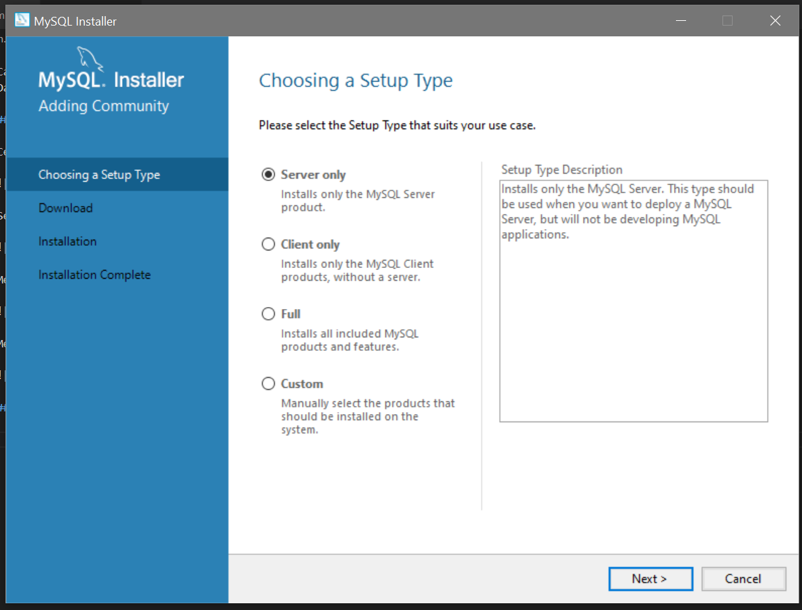

Catatan :
Dalam mengerjakan praktikum pertemuan 6 ini menggunakan OS windows 10 dan menggunakan text editor Visual Studio Code.

## 1 Install compailer Go 

Cek compailer go di CMD apakah Go sudah terinstal atau belum dengan mengetik ` go version` :

Setup Go path :

Membuat program :

Mencoba menjalankan program dengan mengetik 'go run "nama file".go`

## 2 Install MySQL

Memilih set-up file 

