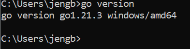
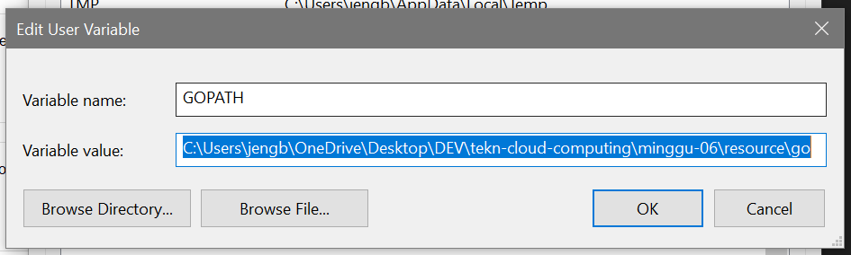
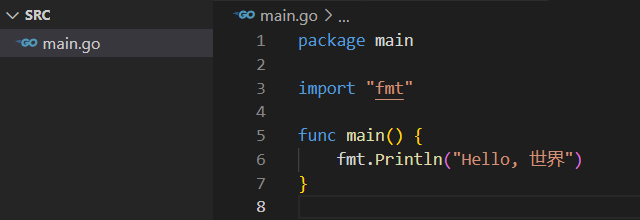
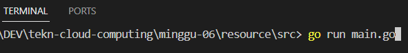

Catatan :
Dalam mengerjakan praktikum pertemuan 6 ini menggunakan OS windows.

## Install compailer Go 

Cek compailer go di CMD apakah Go sudah terinstal atau belum :

Setup Go path :

Membuat program :

Mencoba menjalankan program 

