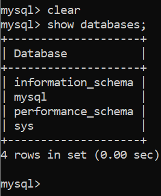

Catatan :
Dalam mengerjakan praktikum pertemuan 6 ini menggunakan OS windows 10 dan menggunakan text editor Visual Studio Code.

# 1 Install compailer Go 

Cek compailer go di CMD apakah Go sudah terinstal atau belum dengan mengetik ` go version` :

Setup Go path :

Membuat program :

Mencoba menjalankan program dengan mengetik 'go run "nama file".go`

# 2 Install MySQL

Memilih set-up file

Memilih apa saja yang akan didownload 

Proses install mySQL

Cek apakah mySQL sudah terinstall atau belum 

Login di mySQL 

Cek database 

# Install MogoDB

Set-Up MongoDB

Memilih versi mongoDB

Tampilan Kompas mongoDB

