## 1 Install Docker Dekstop

Proses install Docker dekstop di Windows


Memilih pengaturan pengistallan yang direkomendasikan 


Sign Up ke akun Docker 


Siap membuat sebuah image dengan Docker


## 2 Get Started 

Cloning get-started docker repository 

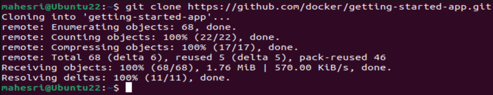

Mengecek hasil cloningan 

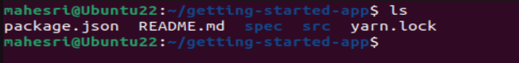

Menambahkan konten konfigurasi image kedalam docker file 

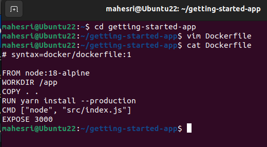

Ketikan `docker run -dp 127.0.0.1:3000:3000 getting-started`

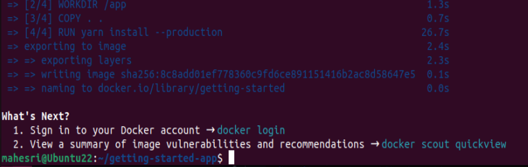

Masuk web browser dan ketikan `127.0.0.1:3000`

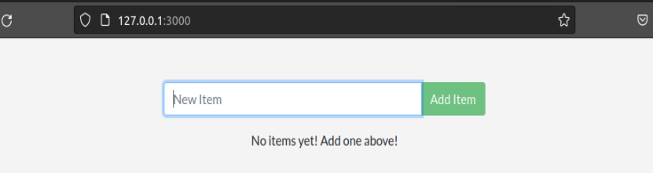

Menambahkan item kedalam aplikasi to do

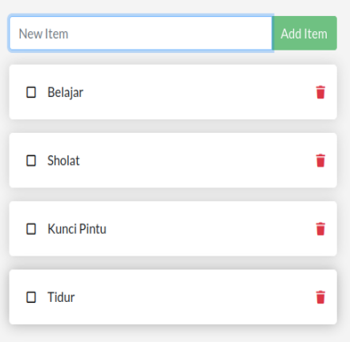

Mengecek container yang sedang running

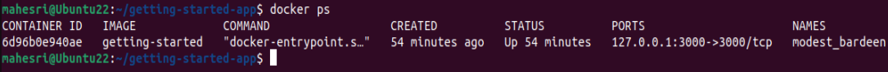

Memodifikasi `src/static/js/app.js' ketikan : 

``````
- <p className="text-center">No items yet! Add one above!</p>
+ <p className="text-center">You have no todo items yet! Add one above!</p>
``````
Menghapus container yang sedang berjalan dengan `docker rf -f <id / nama container>`

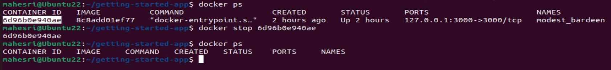

Berbagi repository image 

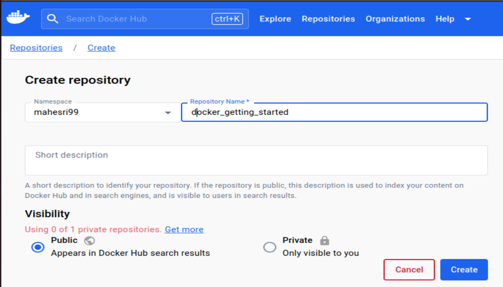

Login docker di CLI 

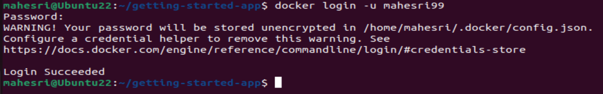

Cek Images yang sedang running 

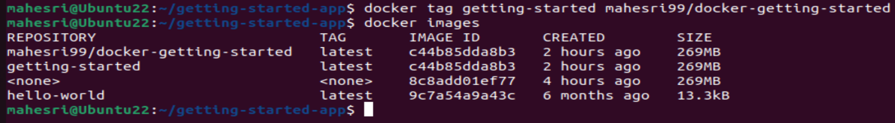

Push image ke reposytory yang tadi dibuat 

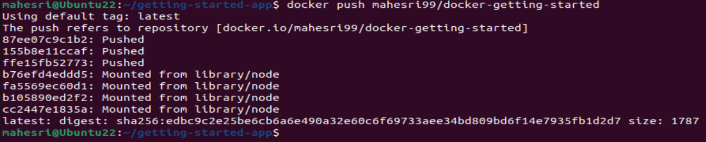

Cek hasil image yang berhasil di push ke repository

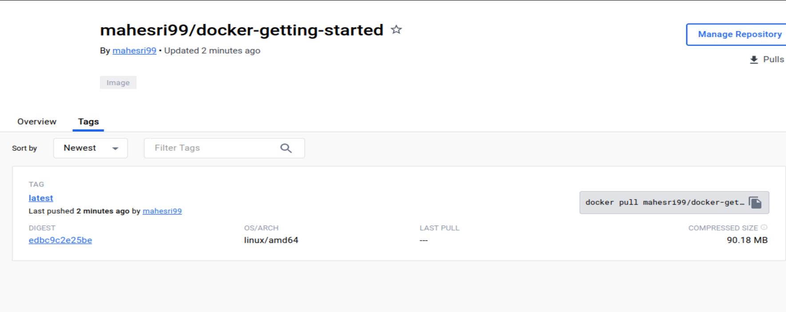

Belajar docker secara online dengan klik [play-with-docker](https://labs.play-with-docker.com/)

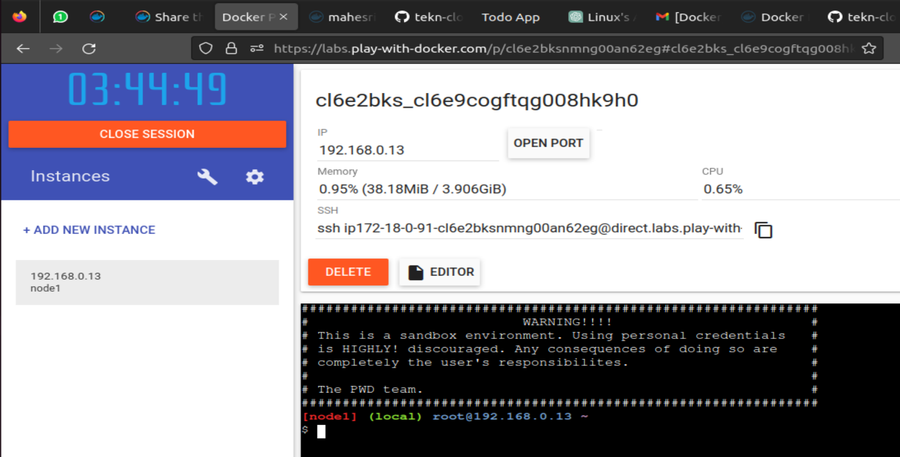

Manjalankan image yang tadi dibuat direpository dengan play with docker 

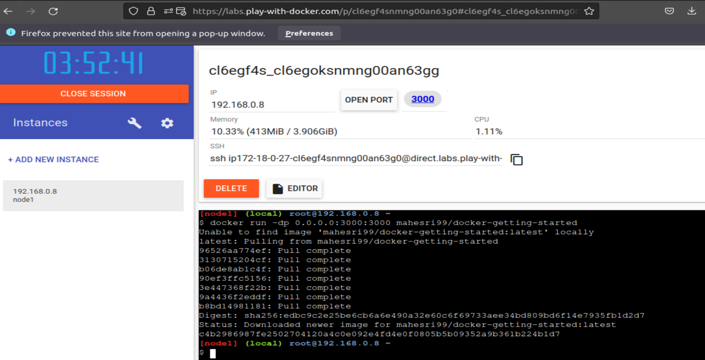


Tekan port 300 maka akan dialihkan ke todo app seperti digambar berikut 

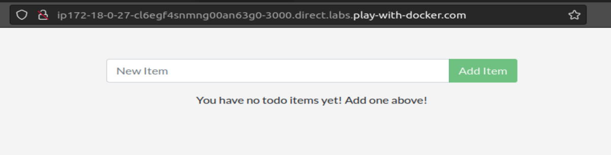

Membuat database todo di docker 

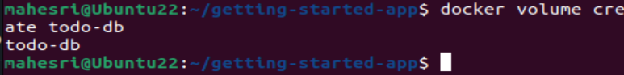

<b>Persist DB</b> dalam langkah ini, ditujukan untuk belajar agar data yang kita buat dapat menyimpan file di host dan membuatnya tersedia untuk kontainer berikutnya, kontainer berikutnya seharusnya dapat melanjutkan dari tempat yang terakhir ditinggalkan. Dengan membuat volume dan menautkannya dengan kontainer yang baru.


Membuat database 

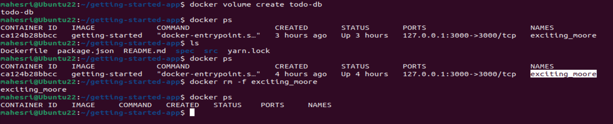

Menghapus image sebelumnya yang masih berjalan 

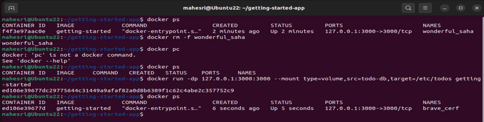

Buka kembali aplikasi todo di lokalhost dan tambahkan beberapa item 

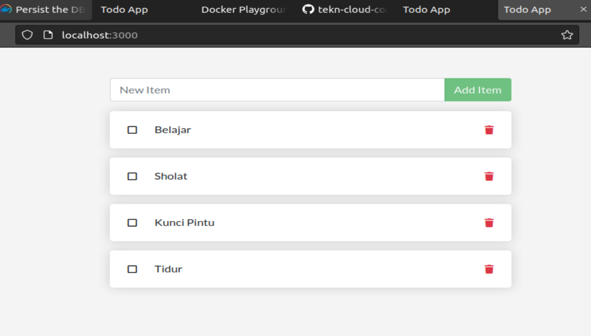

Mengetahui letak todo-db

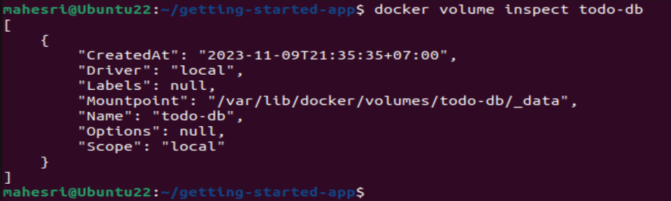

Memberi tahu docker membuat --mount

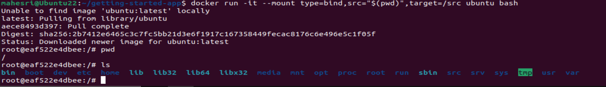

Create myfile.txt

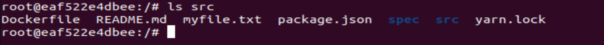

Membuat docker network 

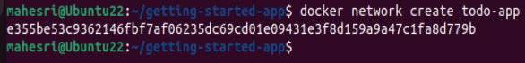

Menghubungkan Kontainer kedalam network

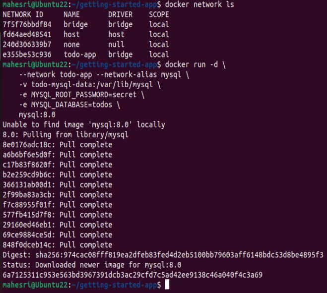

Melihat database

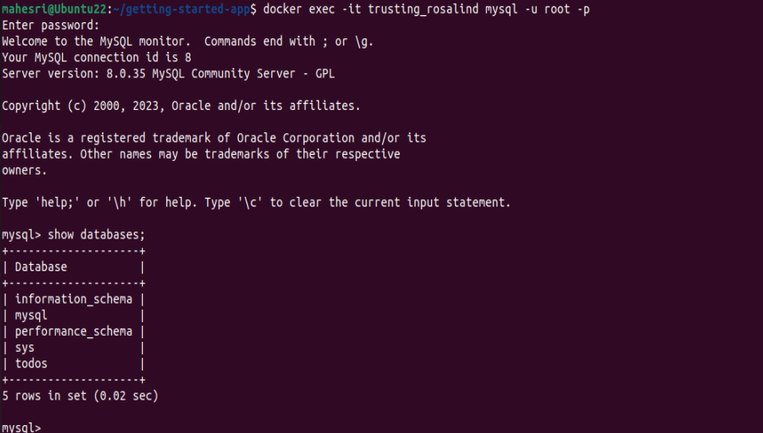

Mneginstall netsnod 

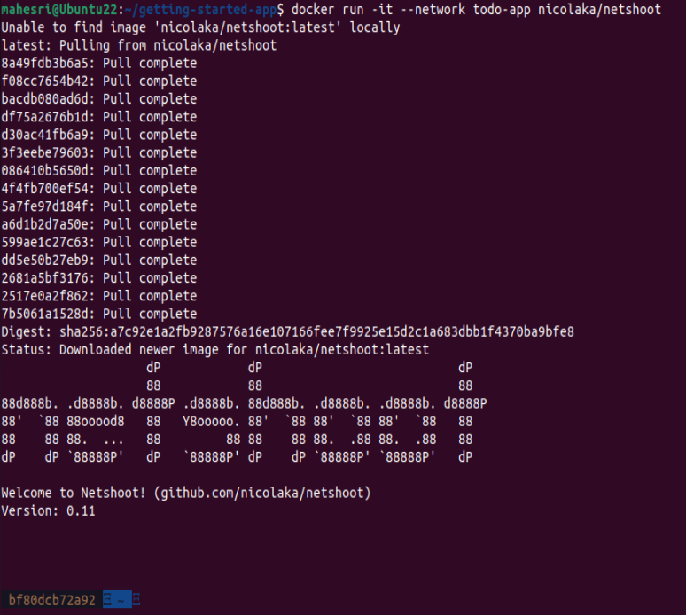

Dig mysql

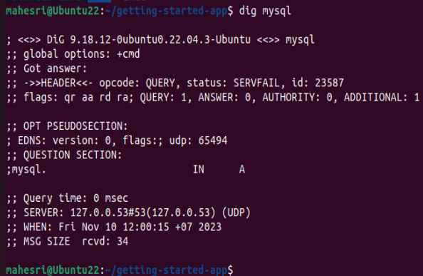

Melihat log yang sedang berlangsung dari kontainer todo-app  

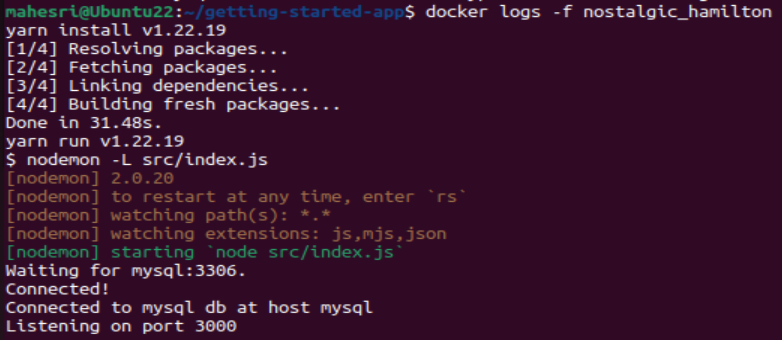

Melihat item yang kita tambahkan diitem todo yang kita tambahka di localhost tadi ke database terakhir kita buat di CLI 


<b>Docker compose</b>

Docker compose memungkinkan kita mendefinisikan tumpukan aplikasi Anda dalam satu file.

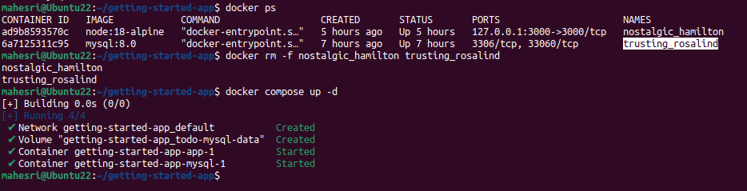

Langkah terakhir mengetahui daftar aplikasi yang ter-compose 

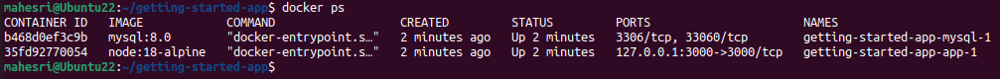