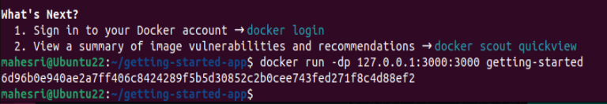

## 1 Install Docker Dekstop

Proses install Docker dekstop di Windows

Memilih pengaturan pengistallan yang direkomendasikan 

Sign Up ke akun Docker 

Siap membuat sebuah image dengan Docker

## 2 Get Started 

Cloning get-started docker repository 

Mengecek hasil cloningan 

Menambahkan konten konfigurasi image kedalam docker file 

Login ke dalama docker

