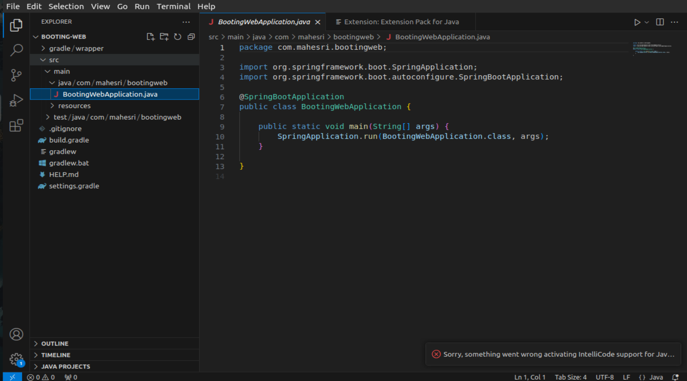
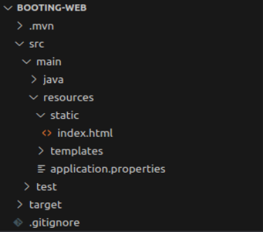
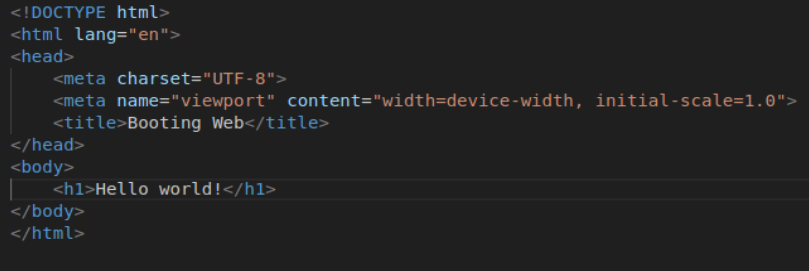
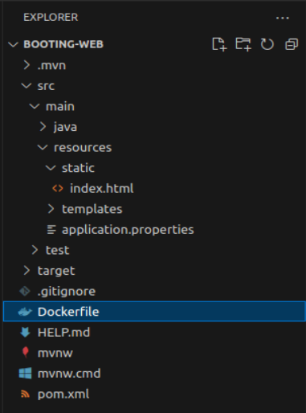
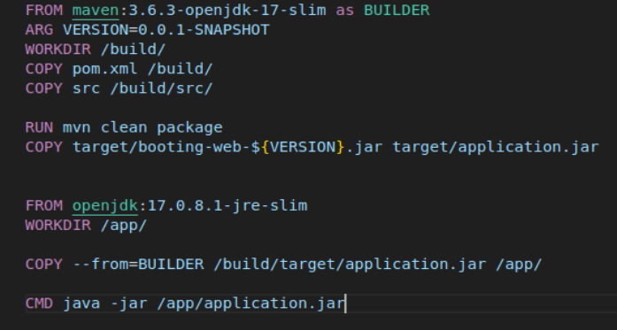
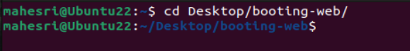

## Spring Boot Docker Image

Masuk ke laman Spring Framework [spring.io](https://start.spring.io) untuk membuat project sesuai dengan kebutuhan, dalam praktik ini hal-hal yang diperlukan diantaranya : 

1. Build : Maven 3.5.1
2. Dependenci : Spring Web
3. Java JDK 17

Buka hasil generate dengan visual studio code 

Menambahkan file html kedalam folder `main/resource/static/` 

Edit file html sesuai kebutuhan 

Dalam directori booting-web buat file baru dengan nama `Dockerfile`

Ketikan seperti pada gambar dibawah ini kedalam file `Dockerfile` yang baru saja dibuat

Buka terminal dan masuk kedalam directory booting-web 

