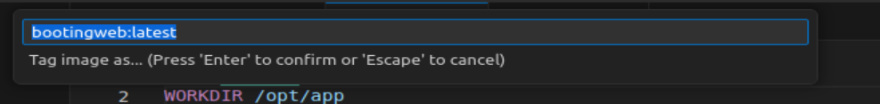
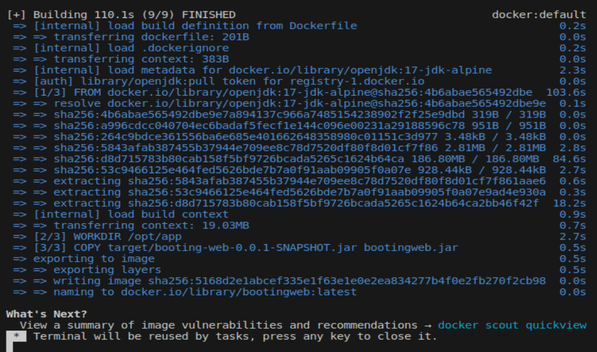
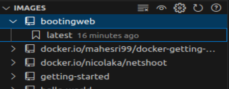
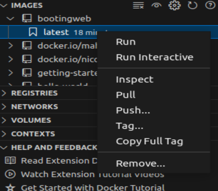
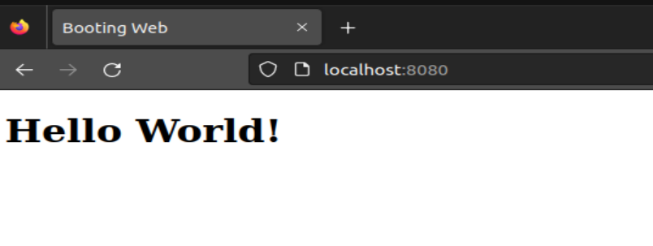
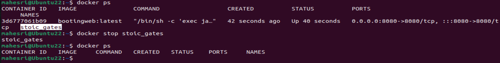

## Spring Boot Docker Image

Masuk ke laman Spring Framework [spring.io](https://start.spring.io) untuk membuat project sesuai dengan kebutuhan, dalam praktik ini hal-hal yang diperlukan diantaranya : 

1. Build : Maven
2. Dependenci : Spring Web
3. Java JDK 17
4. Maven versi : 3.5.3

Catatan : 

Konfigurasi "Dockerfile" bergantung dengan versi java yang kita gunakan, dengan demikian, pastikan dependensi elemen yang kita pakai di Spring io sesuai dengan JDK ataupun build yang ada dimesin kita.

Buka hasil generate dengan visual studio code 

Menambahkan file html kedalam folder `main/resource/static/` 

Edit file html sesuai kebutuhan 

Dalam directori booting-web buat file baru dengan nama `Dockerfile`

Ketikan seperti pada gambar dibawah ini kedalam file `Dockerfile` yang baru saja dibuat

Buka terminal dan masuk kedalam directory booting-web 

Update snapshot.jar yang akan kita gunakan dengan mengetikan `mvn clean package`

Tunggu sampi proses selesai 

Klik kanan pada image dan pilih "build image"

Sesuaikan versi image yang akan kita buat

Pastikan build image telah selesai dengan terminal yang menampilkan output sebagai berikut :

Lihat image di docker extensions

Klik dan pilih "run" dalam image tersebut

Cek Image yang sedang running dengan type `docker ps` bisa di terminal vscode ataupun terminal linux

Buka localhost:8080 untuk mengecek app yang kita bangun bekerja atau tidak

Catatan :
port 8080 adalah port yang umumnya diapakai oleh framework spring boot

Stop image dengan type `docker stop <id kontainer>` bisa dilakukan di termianl vscode ataupun linux 

## Selesai