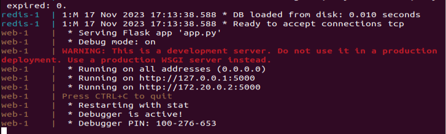
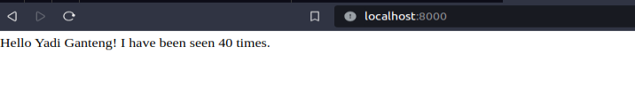
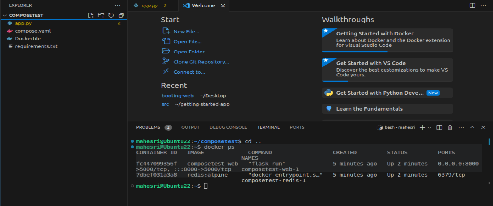
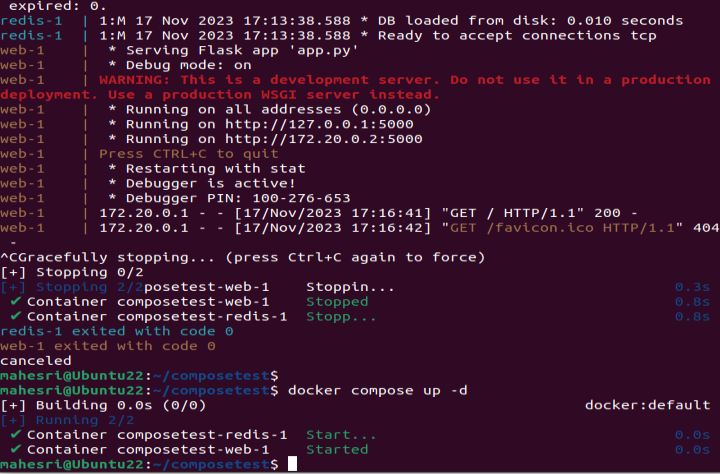
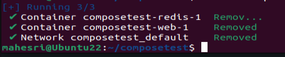

## Getting Started - DOCKER COMPOSE 

Buat folder baru dengan nama "composetest"

```
mkdir composetest
cd composetest
```

Buat file aplikasi dengan nama `app.py` dan paste-kan program berikut : 
```
import time

import redis
from flask import Flask

app = Flask(_name_)
cache = redis.Redis(host='redis', port=6379)

def get_hit_count():
    retries = 5
    while True:
        try:
            return cache.incr('hits')
        except redis.exceptions.ConnectionError as exc:
            if retries == 0:
                raise exc
            retries -= 1
            time.sleep(0.5)

@app.route('/')
def hello():
    count = get_hit_count()
    return 'Hello World! I have been seen {} times.\n'.format(count)
```

 Yang mana program tersebut merupakan pemrogram Python. Beberapa tanda pengenal dari penggunaan Python dalam program tersebut melibatkan sintaks, modul, dan metode tertentu yang umum digunakan dalam bahasa pemrograman ini.

Contoh tanda pengenal penggunaan Python dalam program tersebut:

- Import Modul Python:

Statement import digunakan untuk mengimpor modul-modul Python yang diperlukan. Dalam program di atas, import time dan import redis digunakan untuk mengimpor modul time dan redis.

- Fungsi:

Fungsi-fungsi seperti time.sleep dan redis.Redis menunjukkan penggunaan fungsi built-in Python dan fungsi dari modul pihak ketiga (redis).

- Exception Handling:

Blok try-except menunjukkan penanganan exception (pengecualian) dalam Python. Dalam hal ini, program mencoba melakukan operasi tertentu pada cache Redis, dan jika terjadi kesalahan koneksi, maka akan menunggu sebentar dan mencoba kembali.

- String Formatting:

Penggunaan metode format pada string ('Hello World! I have been seen {} times.\n'.format(count)) adalah cara umum untuk melakukan penggantian nilai variabel dalam string di Python.

Dalam program tersebut juga terdapat fungsi yang secara explisit dapat saya jelaskan sebagai berikut :

- cache.incr('hits'):

Fungsi ini menggunakan objek cache (yang merupakan objek Redis) untuk melakukan operasi peningkatan (increment) pada kunci ('hits') di Redis. Ini secara efektif meningkatkan nilai yang terkait dengan kunci 'hits' setiap kali fungsi ini dipanggil.

- while True: dan retries:

Fungsi ini berada dalam loop while True, yang berarti akan mencoba terus menerus sampai operasi peningkatan berhasil. Variable retries digunakan untuk membatasi jumlah percobaan.

- try-except:

Blok try mencoba menjalankan operasi peningkatan di Redis. Jika berhasil, nilai yang dihasilkan oleh cache.incr('hits') akan dikembalikan oleh fungsi menggunakan pernyataan return.

- except redis.exceptions.ConnectionError:

Jika terjadi kesalahan koneksi Redis (ConnectionError), maka blok except akan menangkap exception tersebut. Program akan mencoba kembali untuk terhubung hingga batas retries tercapai.

- time.sleep(0.5):

Jika terjadi kesalahan koneksi, fungsi akan tertidur (sleep) selama 0.5 detik sebelum mencoba kembali. Ini membantu mengurangi tekanan pada sistem dan memberikan waktu untuk memulihkan koneksi.

Dengan menggunakan mekanisme ini, fungsi get_hit_count() memastikan bahwa operasi peningkatan di Redis berhasil dan mengembalikan jumlah kunjungan yang ditingkatkan. Fungsi ini digunakan dalam rute utama (@app.route('/')) untuk mendapatkan jumlah kunjungan dan menampilkan pesan "Hello World! I have been seen {} times." di halaman web yang bisa dilihat [disini](04.localhost-display.PNG).


buat file baru dengan nama "requirements.txt" dan pastekan tulisan berikut :

```
flask
redis
```

Pastikan tulisan app.py dan requirements.txt sudah benar 


Buat sebuah `Dockerfile` dan tuliskan keperluan konfigurasi seperti dibawah ini : 

```
# syntax=docker/dockerfile:1
FROM python:3.7-alpine
WORKDIR /code
ENV FLASK_APP=app.py
ENV FLASK_RUN_HOST=0.0.0.0
RUN apk add --no-cache gcc musl-dev linux-headers
COPY requirements.txt requirements.txt
RUN pip install -r requirements.txt
EXPOSE 5000
COPY . .
CMD ["flask", "run"]
```

Buat sebuah file konfigurasi antar container yaml dengan nama "compose.yaml" dan menuliskan program dibawah ini : 
```
services:
  web:
    build: .
    ports:
      - "8000:5000"
  redis:
    image: "redis:alpine"
```

Setelah itu masuk ke Step 4: Build and run our app dengan mengetikan `docker compose up`



masuk ke `localhost:8000/` dengan mengetikannya didalam tab browser :



Mengecek container yang sedang berjalan dimesin kita 



Membuat Kontainer dapat berjalan didalam background dengan mengetikan `docker compose up -d`



Hapus container yang sudah berjalan dan menghapus volume data yang ada di redis dengan perintah `docker compose down --volumes`



Selesai 