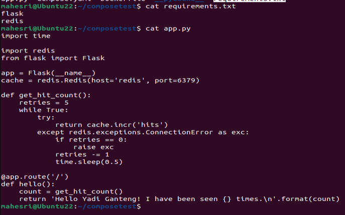

## Getting Started - DOCKER COMPOSE 

Buat folder baru dengan nama "composetest"

```
mkdir composetest
cd composetest
```

Buat file aplikasi dengan nama `app.py` dan paste-kan program berikut : 
```
import time

import redis
from flask import Flask

app = Flask(_name_)
cache = redis.Redis(host='redis', port=6379)

def get_hit_count():
    retries = 5
    while True:
        try:
            return cache.incr('hits')
        except redis.exceptions.ConnectionError as exc:
            if retries == 0:
                raise exc
            retries -= 1
            time.sleep(0.5)

@app.route('/')
def hello():
    count = get_hit_count()
    return 'Hello World! I have been seen {} times.\n'.format(count)
```

buat file baru dengan nama "requirements.txt" dan pastekan tulisan berikut :

```
flask
redis
```

Pastikan tulisan app.py dan requirements.txt sudah benar 



Buat sebuah `Dockerfile` dan tuliskan keperluan konfigurasi seperti dibawah ini : 

```
# syntax=docker/dockerfile:1
FROM python:3.7-alpine
WORKDIR /code
ENV FLASK_APP=app.py
ENV FLASK_RUN_HOST=0.0.0.0
RUN apk add --no-cache gcc musl-dev linux-headers
COPY requirements.txt requirements.txt
RUN pip install -r requirements.txt
EXPOSE 5000
COPY . .
CMD ["flask", "run"]
```

Buat sebuah file konfigurasi antar container yaml dengan nama "compose.yaml" dan menuliskan program dibawah ini : 
```
services:
  web:
    build: .
    ports:
      - "8000:5000"
  redis:
    image: "redis:alpine"
``` 