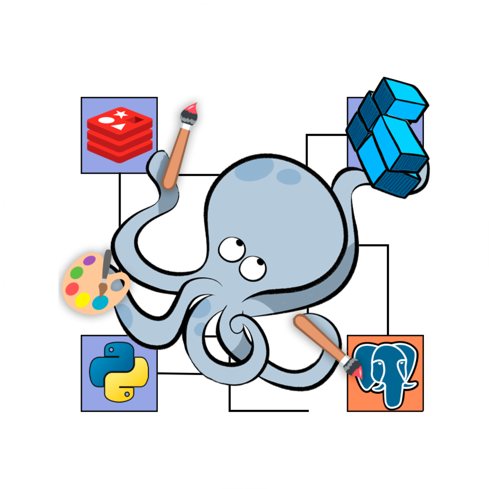
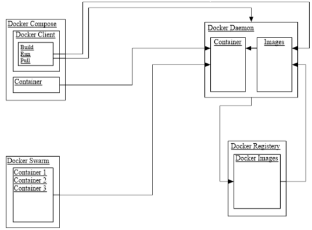

## Diagram Keterkaitan Komponen Docker :

1. Docker image
2. Container
3. dockerd
4. docker client
5. docker compose
6. docker swarm

Diagram Keterkaitan 

Penjelasan masing-masing komponen :

- Docker image:

Docker image adalah blueprint atau template read-only yang berisi semua informasi yang diperlukan untuk menjalankan suatu aplikasi. Image dapat berisi sistem operasi, perangkat lunak aplikasi, dependensi, dan konfigurasi lainnya. Image menjadi dasar untuk membuat container.

- Container:

Container adalah instance yang berjalan dari suatu Docker image. Container menyediakan lingkungan runtime yang terisolasi untuk menjalankan aplikasi. Container bersifat read-write dan dapat diubah selama berjalan. Container dapat dihentikan, dihapus, dan diganti dengan container baru.

- Dockerd:

dockerd (Docker Daemon) adalah komponen inti dari Docker. Ini adalah background process yang mengelola Docker containers di host sistem. dockerd bertanggung jawab untuk mendownload, mengelola, dan menjalankan Docker containers berdasarkan instruksi yang diberikan oleh Docker client atau tools lainnya.

- Docker client:

Docker client adalah antarmuka yang memungkinkan pengguna berinteraksi dengan Docker Daemon (dockerd). Melalui Docker client, pengguna dapat memberikan perintah-perintah untuk membangun, menjalankan, dan mengelola container dan image Docker. Perintah-perintah ini dapat diberikan melalui terminal atau melalui antarmuka grafis.

- Docker Compose:

Docker Compose adalah alat yang memungkinkan definisi dan jalannya aplikasi multi-container. Dengan Docker Compose, Anda dapat mendefinisikan layanan, jaringan, dan volume dalam file konfigurasi YAML. Ini mempermudah pengelolaan aplikasi yang terdiri dari beberapa container.

- Docker Swarm:

Docker Swarm adalah fitur orkestrasi built-in dalam Docker untuk mengelola dan mengeksekusi aplikasi yang terdiri dari beberapa container di lingkungan cluster. Docker Swarm memungkinkan Anda untuk menyusun, memantau, dan mengelola container di berbagai host untuk meningkatkan ketersediaan dan skalabilitas.