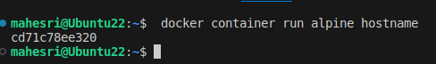
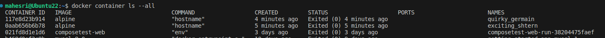

## Docker for Beginners - Linux 

Clone repo berikut kedalam repo local kita : `git clone https://github.com/dockersamples/linux_tweet_app`

Pulls container yang terbaru dari Docker Hub dengan perintah berikut ` docker container run alpine hostname`

Apabila container sudah ter-pulls maka akan didapati output sebagai berikut 

List all containers dengan perintah berikur `docker container ls --all` :

