# Docker for Beginners - Linux 

## Task 0: Prerequisites

Clone repo berikut kedalam repo local kita : `git clone https://github.com/dockersamples/linux_tweet_app`

## Task 1: Run some simple Docker containers

Pulls container yang terbaru dari Docker Hub dengan perintah berikut ` docker container run alpine hostname`

Apabila container sudah ter-pulls maka akan didapati output sebagai berikut 


List all containers dengan perintah berikur `docker container ls --all` :


Menjalankan kontainer interaktif Ubuntu di atas host Docker yang menggunakan Alpine Linux dengan perintah berikut `docker container run --interactive --tty --rm ubuntu bash`

Catatan : 

- `--interactive`: Menyatakan bahwa kita ingin sesi interaktif di dalam kontainer.
- `--tty`: Mengalokasikan pseudo-tty (memberikan kontainer akses ke terminal).
- `--rm`: Menginstruksikan Docker untuk menghapus kontainer setelah selesai dieksekusi.
- `ubuntu`: Menentukan bahwa kita ingin menjalankan kontainer berdasarkan image Ubuntu.
- `bash`: Menentukan bahwa perintah utama yang akan dijalankan di dalam kontainer adalah shell bash.

Dari eksekusi perintah diatas, kita akan masuk kedalam shell bash container dengan prompt di shell yang berubah menjadi `root@<container id>:/#` 

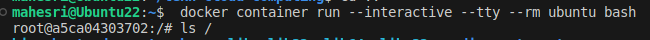

Menampilkan isi direktori root di dalam kontainer dengan perintah `ls /`

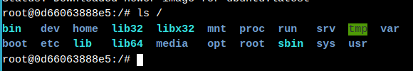

Menampilkan proses yang berjalan di dalam kontainer dengan perintah berikut `ps aux`

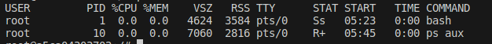

Melihat distribusi Linux yang dijalankan di dalam kontainer dengan perintah berikut `cat /etc/issue`

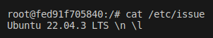

Menjalankan container MySQL dengan mengetikan perintah berikut 

```
 docker container run \
 --detach \
 --name mydb \
 -e MYSQL_ROOT_PASSWORD=my-secret-pw \
 mysql:latest
```

Catatan : 
Apabila image MySQL belum tersedia sebelumnya di mesin kita, maka akan didapati output sebagai berikut : 

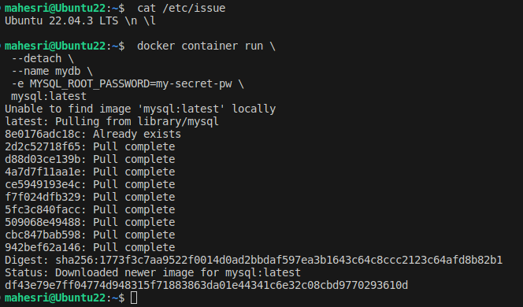

Catatan : 

- `--detach \` : akan menjalankan container di background mesin kita
- `--name` : akan memberinya nama `mydb \`
- `-e MYSQL_ROOT_PASSWORD=my-secret-pw \-` : Menjadikannya password untuk login dimySQL

Melihat container yang sedang berjalan dengan perintah `docker container ls` 

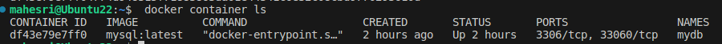


Melihat catatan yang dihasilkan oleh container dengan perintah `docker container logs mydb`

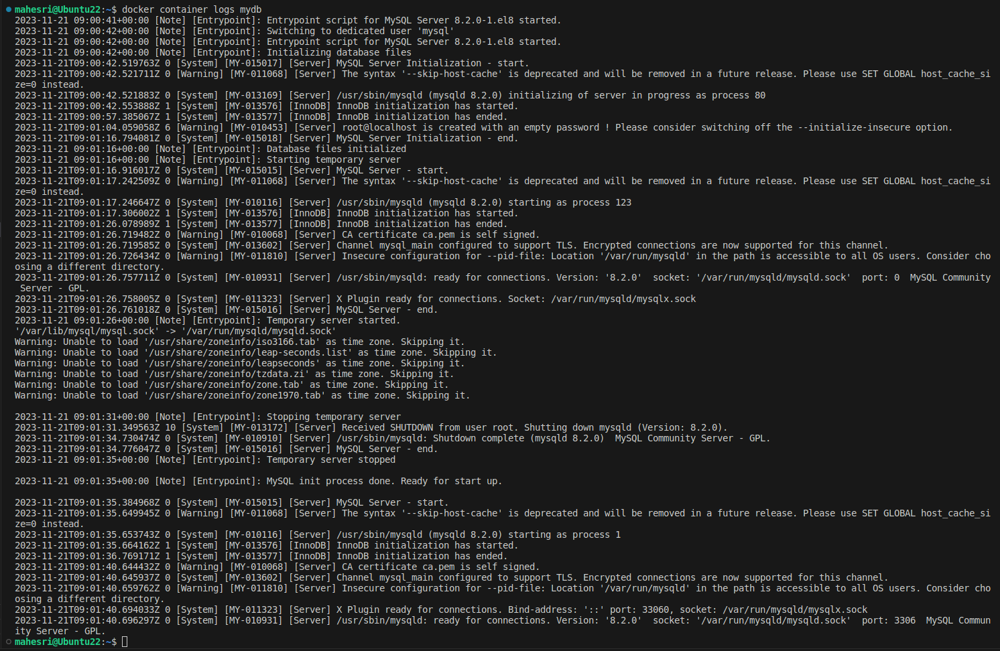

Melihat proses running di dalam container dengan perintah berikut `docker container top mydb`

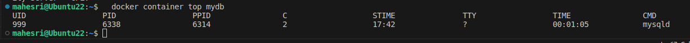

Menjalankan command line didalam container dengan perintah berikut `docker container exec` dan masuk kedalam comand line container untuk mengecek versi mySQL didalam container


Mencoba masuk kedalam shell bash baru yang interaktif dengan perintah `docker exec -it mydb sh` perintah ini dapat dijalankan di shell bash meskipun container dalam kondisi running sekalipun. 

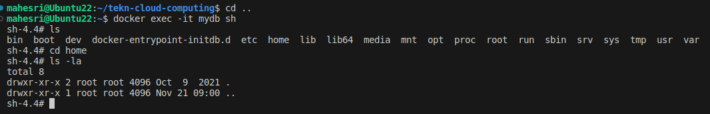

Cek versi mySQL langsung dari dalam bash shell container dengan perintah ` mysql --u=root --password=$MYSQL_ROOT_PASSWORD --version`

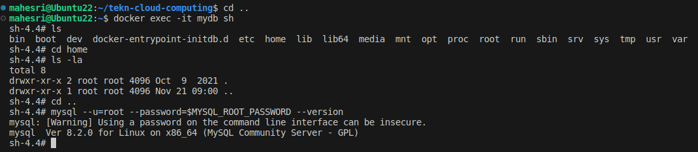

keluar dari mode interaktif dengan perintah `exit`

## Task 2: Package and run a custom app using Docker

Pastikan masuk ke dalam directory linux_tweet_app dengan perintah `cd linux_tweet_app` apabila di directory belum ada maka bisa clone dengan perintah `git clone https://github.com/dockersamples/linux_tweet_app`


Buka file Dockerfile dengan perintah `cat dockerfile`


Catatan :

1. FROM:

FROM menentukan gambar dasar yang akan digunakan sebagai titik awal untuk membuat gambar Docker baru. Dalam contoh ini, gambar dasar yang digunakan adalah nginx:latest, yang merupakan gambar terbaru dari nginx.

2. COPY:

COPY digunakan untuk menyalin file dari host Docker ke dalam gambar Docker pada lokasi yang diketahui. Dalam contoh ini, perintah COPY digunakan untuk menyalin dua file ke dalam gambar: index.html dan sebuah grafik yang akan digunakan di situs web.

3. EXPOSE:

EXPOSE mendokumentasikan port-port yang akan digunakan oleh aplikasi di dalam kontainer. Ini memberikan informasi kepada pengguna atau pengembang mengenai port yang perlu dibuka ketika kontainer dijalankan.

4. CMD:

CMD menentukan perintah yang akan dijalankan ketika kontainer dibuat dari gambar. Dalam contoh ini, CMD memberikan perintah untuk menjalankan aplikasi atau layanan yang diinginkan. Perlu dicatat bahwa CMD dapat mendefinisikan perintah dan argumen waktu eksekusi.

5. Export DOCKERID:

Baris terakhir menginstruksikan pengguna untuk mengekspor variabel lingkungan (DOCKERID) yang berisi ID Docker unik pengguna. Ini membantu dalam membuat perintah-perintah selanjutnya menjadi lebih mudah dicopy dan dijalankan tanpa harus mengetik ulang ID Docker setiap kali.

Masukan docker id dengan perintah `export DOCKERID=<id docker>` apabila belum memiliki docker id bisa membuat [disini](https://hub.docker.com/)

Menampilkan id yang tadi kita masukan dengan perintah ` echo $DOCKERID`

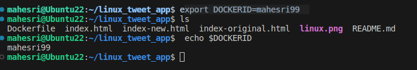

Membuat sebuah docker image bari dengan perintah `docker image bulid` tambahkan `--tag` agar nama image tersebut dapat kita custom sesuai dengan keinginan kita.

Cek build image jika proses build sudah selesai.

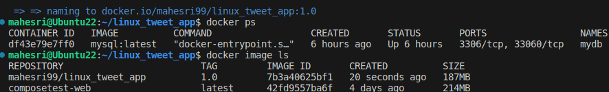

Run image yang baru saja kita buat dengan perintah berikut :
```
 docker container run \
 --detach \
 --publish 80:80 \
 --name linux_tweet_app \
 $DOCKERID/linux_tweet_app:1.0
```

Catatan : 
`--publish 80:80 \`: adalah alamat port di localhost kita.

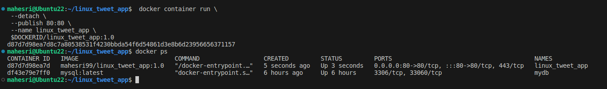

Cek container yang baru saja dijalankan dilocalhost dengan masuk ke browser dan ketikan `localhost:80/` di tab baru .

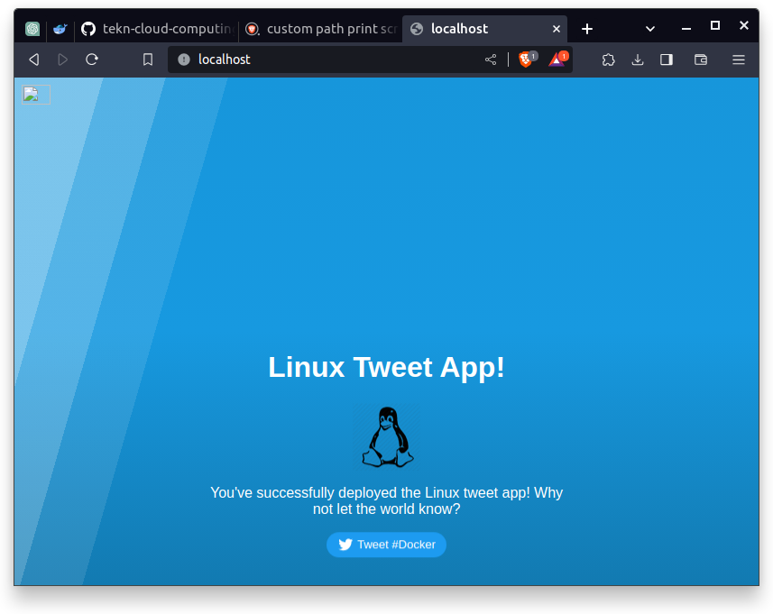

Matikan conatiner yang sedang berjalan dengan perintah `docker container rm --force linux_tweet_app`

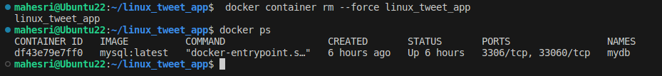

## Task 3: Modify a running website

Memulai aplikasi linux_tweet_app dengan bind mount dengan mengetikan perintah :

```
docker container run \
 --detach \
 --publish 80:80 \
 --name linux_tweet_app \
 --mount type=bind,source="$(pwd)",target=/usr/share/nginx/html \
 $DOCKERID/linux_tweet_app:1.0
```

Catatan : 

Bind mount dalam Docker adalah cara untuk mengaitkan (bind) suatu direktori atau file dari host sistem ke dalam kontainer Docker. Dengan menggunakan opsi -v atau --volume pada perintah docker run, Anda dapat membuat hubungan langsung antara lokasi di host dan di dalam kontainer, memungkinkan kontainer mengakses dan memodifikasi data pada host. Bind mount sangat berguna untuk berbagi data atau konfigurasi antara host dan kontainer, dan perubahan yang terjadi di satu sisi segera terlihat di sisi lainnya.

Memodifikasi tampilan website yang sedang berjalan dengan me-replace file index.html dengan index-new.html dengan perintah ` cp index-new.html index.html` dengan perintah tersebut, tampilan website yang sebelumnya didapati sebagai berikut :


Menjadi sebagai seperti ini : 

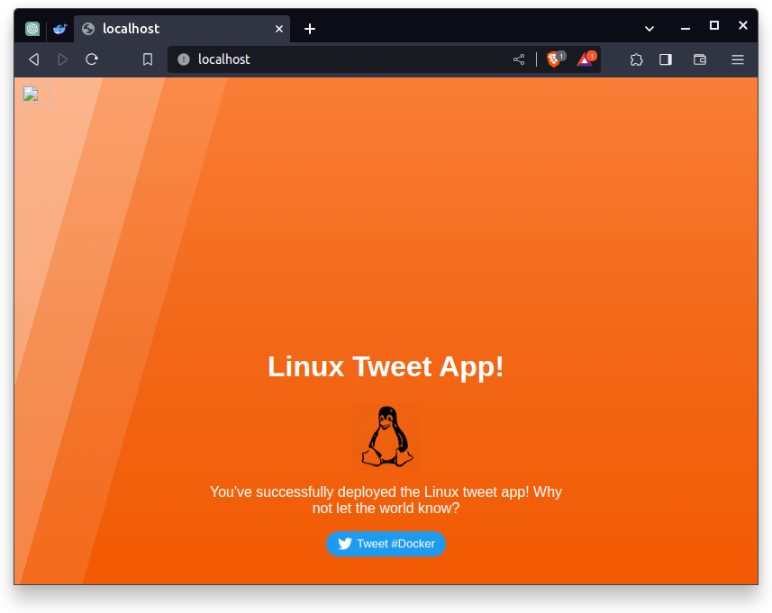

Membuat image baru dengan memodifikasi file index.html didirectory host `linux_tweet_app`

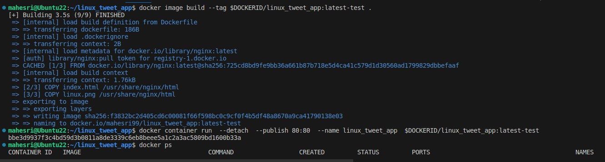

Buka kembali localhost.

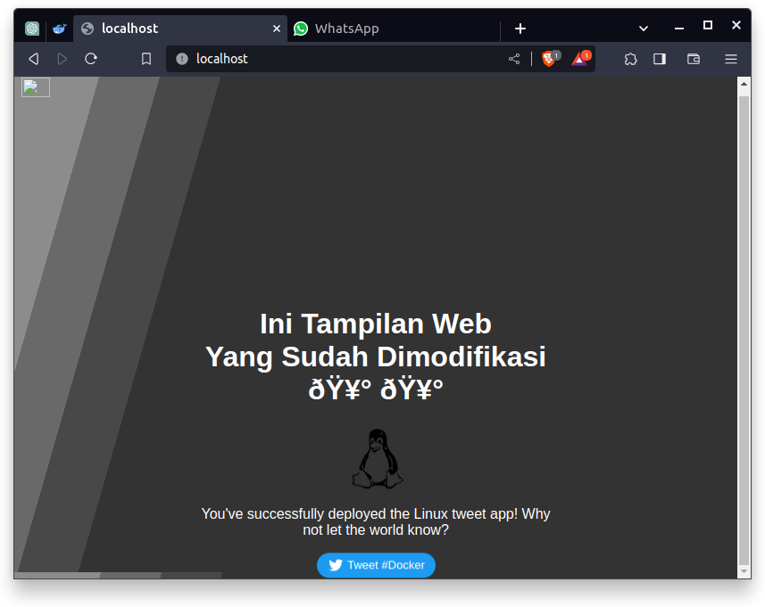

Cek history image yang sebelumnya sudah kita bangun.

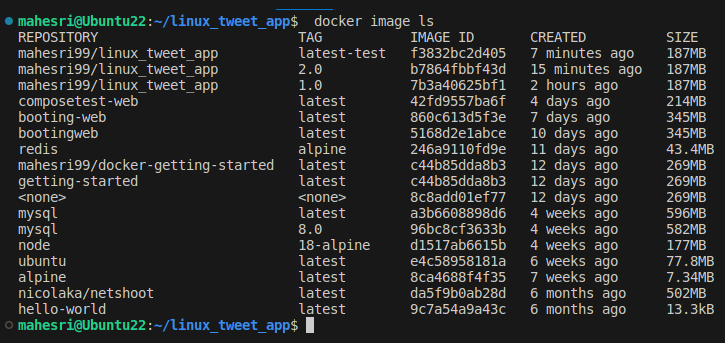

Menjalankan container versi lama secara bersamaan degan container yang baru saja dibuat.

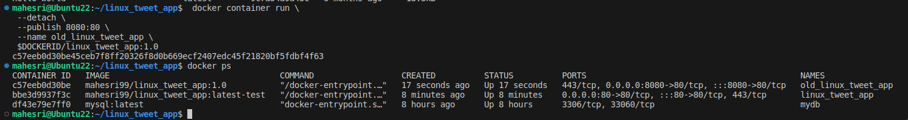

Push images ke Docker Hub dengan perintah ` docker image ls -f reference="$DOCKERID/*"`

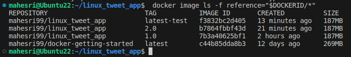


