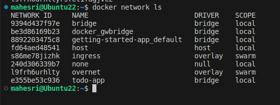
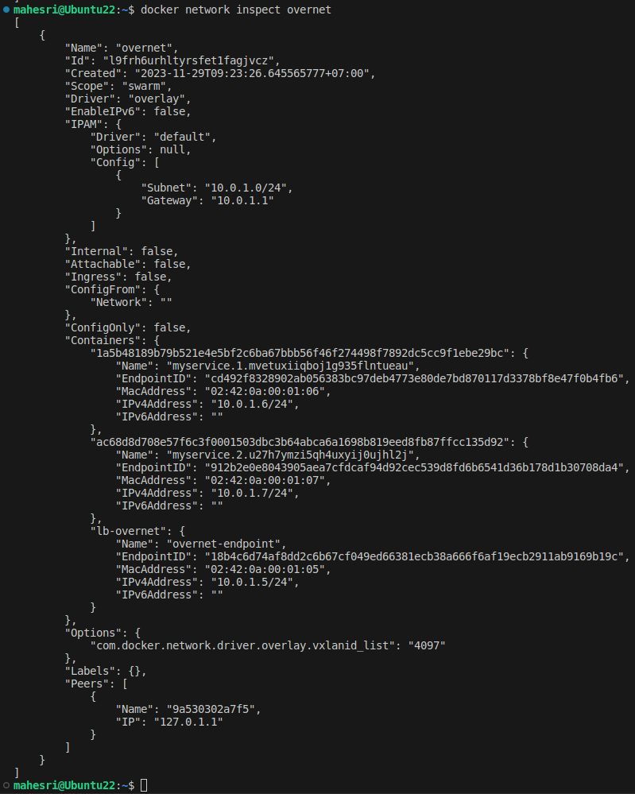

# Docker Networking

## Section #1 - Networking Basics

### Task 1 : Networking Basics

Melihat daftar commands utama dengan perintah `docker network` daftar commands utama berisi command untuk mengkonfigurasi dan mengatur network 
container network.

### Step 2: List networks

Melihat Docker Network yang tersedia saat ini di host dengan perintah `docker network ls`


### Step 3: Inspect a network

Melihat detail sebuah network dari container di docker host kita dengan perintah `docker network inspect bridge` dari prompt tersebut maka akan didapati output sebagai berikut : 

```
[
    {
        "Name": "bridge",
        "Id": "b836373449ed285a95cb41724a347b37144bb33be7fd428849c5af9
276ec23fa",
        "Created": "2023-11-28T23:23:25.906925887Z",
        "Scope": "local",
        "Driver": "bridge",
        "EnableIPv6": false,
        "IPAM": {
            "Driver": "default",
            "Options": null,
            "Config": [
                {
                    "Subnet": "172.17.0.0/16",
                    "Gateway": "172.17.0.1"
                }
            ]
        },
        "Internal": false,
        "Attachable": false,
        "Ingress": false,
        "ConfigFrom": {
            "Network": ""
        },
        "ConfigOnly": false,
        "Containers": {},
        "Options": {
            "com.docker.network.bridge.default_bridge": "true",
            "com.docker.network.bridge.enable_icc": "true",
            "com.docker.network.bridge.enable_ip_masquerade": "true",
            "com.docker.network.bridge.host_binding_ipv4": "0.0.0.0",
            "com.docker.network.bridge.name": "docker0",
            "com.docker.network.driver.mtu": "1500"
        },
        "Labels": {}
    }
]
```

Catatan :

`docker network inspect bridge` adalah perintah untuk mengecek detail dari jaringan bernama `bridge` oleh sebab itu, perintah yang umum digunakan untuk mnegecek sebuah jaringan untuk sebuah container adalah `docker network inspect <nama/id sebuah jaringan>`

### Step 4: List network driver plugins

Cek Installasi Docker di host dengan perintah `docker info`


## Section #2 - Bridge Networking

### Step 1: The Basics


Catatan :
Dalam gambar [03.docker-network-ls](03.docker-network-ls.png) Didapati bahwa `bridge` ter-asosiasi dengan `driver driver` ini menandakan bahwa driver dengan jariangan bridge terkoneksi. Dalam gambar tersebut juga didapati bahwa `bridge` hanya ter-scope dalam docker local kita. 

Menginstall `brctl` command dan menggunakannya untuk membuat daftar Linux bridges di Docker host kita, install `brctl` dengan perintah berikut `sudo apt-get install bridge-utils`.

Cek daftar bridgs dalam Docker host kita dengan perintah `brctl show`


Melihat ip addres di `docker0` seperti yang terdapat dalam gambar output diatas, `docker0` adalah brdge jaringan yang secara otomatis tercipta untuk jaringan bridge, dan dalam output diatas juga didapati tidak ada interfaces yang terkoneksi dengannya.


### Step 2: Connect a container

Buat sebuah conatiner baru dengan perintah `docker run -dt ubuntu sleep infinity` 


Catatan :
Jaringan bridgs adalah jaringan default untuk semua contianer yang baru dibuat, namun kita bisa mengatur jaringa bridgs tersebut untuk jaringan yang berbeda.

Periksa kembali list bridge dengan perintah `brctl show`


Dari gambar diatas didapati bahwa interface bridge `docker0` sekarang terkoneksi dengan container yang baru dibuat. 

Inspect kembali bridge dengan perintah `docker network inspect bridge` 


### Step 3: Test network connectivity

Ping IP conatiner yang kita buat dengan perintah berikut `ping -c5 <ip address>`


Masuk ke shell bash contier dengan perintah `docker exec -it <CONTAINER ID> /bin/bash` setelah itu install program ping melalui root shell bash container dengan perintah berikut `apt-get update && apt-get install -y iputils-ping` proses installasi akan selesai apabila didapati output sebagai berikut 


Ping www.github.com 


Keluar dari shell bash container dan hentikan container yang sedang berjalan :


### Step 4: Configure NAT for external connectivity

Pull container dari NGINX dan menjalankannya di Docker hoste kita, pull dengan perintah beriokut `docker run --name web1 -d -p 8080:80 nginx`


Cek apakah installasi NGINX sudah berhasi dengan masuk ke web browser kita dan mengetikan `localhost:8080/` di tab baru.


## Section #3 - Overlay Networking

### Step 1: The Basics

Menginisialisasi swarm dengan perintah `docker swarm init --advertise-addr $(hostname -i)`


### Step 2: Create an overlay network

Membuat jaringan overlay dengan perintah `docker network create -d overlay overnet` dan akan muncu sebuah output sebagai berikut 
```
l9frh6urhltyrsfet1fagjvcz
```
Periksa kembali daftar Docker network



Catatan :
Jaringan baru seperti (ingress dan docker_gwbridge) seperti yang terlihat dalam gambar  jaringan tersebut akan dibuat secara otomatis ketika cluster Swarm dibuat.

Inspect jaringan overnet dan akan didapati output sebagai berikut 
```[

    {
        "Name": "overnet",
        "Id": "l9frh6urhltyrsfet1fagjvcz",
        "Created": "2023-11-29T02:09:14.633092061Z",
        "Scope": "swarm",
        "Driver": "overlay",
        "EnableIPv6": false,
        "IPAM": {
            "Driver": "default",
            "Options": null,
            "Config": [
                {
                    "Subnet": "10.0.1.0/24",
                    "Gateway": "10.0.1.1"
                }
            ]
        },
        "Internal": false,
        "Attachable": false,
        "Ingress": false,
        "ConfigFrom": {
            "Network": ""
        },
        "ConfigOnly": false,
        "Containers": null,
        "Options": {
            "com.docker.network.driver.overlay.vxlanid_list": "4097"
        },
        "Labels": null
    }
]
```


### Step 3: Create a service

Karena sebelumnya kita sudah menginisialisasi sebuah Swarm dan juga membuat sebuah jaringan overlay, sekrang adalah membuat sebuah service dengan perintah berikut ini 
```
docker service create --name myservice \
--network overnet \
--replicas 2 \
ubuntu sleep infinity
```

Melihat service dengan perintah `docker service ls`


Melihat service yang kita buuat dan jaringannya 


### Step 4: Test the network

Periksa kembali dengan perintah `docker network inspect overnet`



Masuk kembali kedalam shell bash continer, install ping dengan perintah berikut `apt-get update && apt-get install -y iputils-ping` dan ping ip myservice di node yang ke-2 dengan memasukan ipnya 


### Step 5: Test service discovery

Melihat apakah ke-2 service container kita berada pada jaringan overlay yang sama,
masuk kedalam shell bash container dan masukan perintah `cat /etc/resolv.conf` maka akan didapati output sebagai berikut :


Ping myservice container 


Inspect myservice dan didapati output sebagai berikut :

```
[
    {
        "ID": "i4aqc57y9nn4j5kykgy9qkqob",
        "Version": {
            "Index": 14
        },
        "CreatedAt": "2023-11-29T02:23:26.4133206Z",
        "UpdatedAt": "2023-11-29T02:23:26.416382488Z",
        "Spec": {
            "Name": "myservice",
            "Labels": {},
            "TaskTemplate": {
                "ContainerSpec": {
                    "Image": "ubuntu:latest@sha256:2b7412e6465c3c7fc5bb21d3e6f1917c167358449fecac8176c6e496e5c1f05f",
                    "Args": [
                        "sleep",
                        "infinity"
                    ],
                    "Init": false,
                    "StopGracePeriod": 10000000000,
                    "DNSConfig": {},
                    "Isolation": "default"
                },
                "Resources": {
                    "Limits": {},
                    "Reservations": {}
                },
                "RestartPolicy": {
                    "Condition": "any",
                    "Delay": 5000000000,
                    "MaxAttempts": 0
                },
                "Placement": {
                    "Platforms": [
                        {
                            "Architecture": "amd64",
                            "OS": "linux"
                        },
                        {
                            "OS": "linux"
                        },
                        {
                            "Architecture": "arm64",
                            "OS": "linux"
                        },
                        {
                            "Architecture": "ppc64le",
                            "OS": "linux"
                        },
                        {
                            "Architecture": "s390x",
                            "OS": "linux"
                        }
                    ]
                },
                "Networks": [
                    {
                        "Target": "l9frh6urhltyrsfet1fagjvcz"
                    }
                ],
                "ForceUpdate": 0,
                "Runtime": "container"
            },
            "Mode": {
                "Replicated": {
                    "Replicas": 2
                }
            },
            "UpdateConfig": {
                "Parallelism": 1,
                "FailureAction": "pause",
                "Monitor": 5000000000,
                "MaxFailureRatio": 0,
                "Order": "stop-first"
            },
            "RollbackConfig": {
                "Parallelism": 1,
                "FailureAction": "pause",
                "Monitor": 5000000000,
                "MaxFailureRatio": 0,
                "Order": "stop-first"
            },
            "EndpointSpec": {
                "Mode": "vip"
            }
        },
        "Endpoint": {
            "Spec": {
                "Mode": "vip"
            },
            "VirtualIPs": [
                {
                    "NetworkID": "l9frh6urhltyrsfet1fagjvcz",
                    "Addr": "10.0.1.2/24"
                }
            ]
        }
    }
]
```

## Cleaning Up

Cleaning up container myservice dan Swarm 


### selesai