# Application Containerization and Microservice Orchestration

## Stage Setup

Cloning Demo repository 


Masuk ke directory linkextractor dengan mengetikan ` cd linkextractor` di command line interface (CLI) Play With Docker, setelah itu switching repositori ke demo dengan mengetikan perintah `git checkout demo` di CLI.

## Step 0: Basic Link Extractor Script

Checkout `step0` branch dan list isi directory tersebut 


Buka file linkextractor yang ada di list dengan perintah `cat linkextractor.py` dan akan didapati output sebagai berikut :
```
#!/usr/bin/env python

import sys
import requests
from bs4 import BeautifulSoup

res = requests.get(sys.argv[-1])
soup = BeautifulSoup(res.text, "html.parser")
for link in soup.find_all("a"):
    print(link.get("href"))
```

Catatan :
Dalam dalam file `linkextractor`, terdapat scrip phyton sederhana untuk mengimpor tiga paket : sys dari pustaka standar dan dua paket pihak ketiga populer, yaitu requests dan bs4. Argumen baris perintah yang disediakan oleh pengguna (yang diharapkan berupa URL ke halaman HTML) digunakan untuk mengambil halaman menggunakan paket requests, kemudian diparsing menggunakan BeautifulSoup. Objek yang diparsing kemudian diiterasi untuk menemukan semua elemen anchor (yaitu, tag <a>) dan mencetak nilai atribut href yang berisi hyperlink. 

Mencoba menjalankan aplikasi dan mengecek apakah script dapat dijalankan.


Menjalankan script linkextractor sebagai program python dengan mengetikan perintah `python3 linkextractor.py` di CLI dan akan didapai output error sebagai berikut .

```
Traceback (most recent call last):
  File "/root/linkextractor/linkextractor.py", line 4, in <module>
    import requests
ModuleNotFoundError: No module named 'requests'
```

Catatan :
Error tersebut mengindikasikan tentang bebrapa komponen yang belum tersedia didalam host play with Docker, yang mana dalam langkah berikutnya program akan
[di-containerize](https://www.redhat.com/en/topics/cloud-native-apps/what-is-containerization) dengan container Docker untuk memudahkan program tersebut di execute.

## Step 1: Containerized Link Extractor Script

Checkout drictory `step1` dan buka file Docker yang ada dalam directory tersebut


Build image dengan perintah `docker image build -t linkextractor:step1 .` secara otomatis, dengan menggunakan Dockerfile yang ad di list step1 kita dapat menyiapkan image Docker untuk skrip yang tadi sempat gagal di step sebelumnya. Mulai dari image python Docker resmi yang berisi run-time Python environment serta tools yang diperlukan untuk menginstal paket dan dependensi Python.

Mengecek docker image di host dengan perintah `docker image ls`


Jalankan kontainer dengan perintah `docker container run -it --rm linkextractor:step1 http://example.com/` dan akan didapati output sebagai berikut 


Mencoba dalam webpage lain


## Step 2: Link Extractor Module with Full URI and Anchor Text

Checkout ke repositori `step2`


Build Dockerfile yang ada di list dengan perintah `docker image build -t linkextractor:step2 .` dan cek apakah sudah ter-build di host kita, dengan perintah `docker image ls`


Jalankan kontainer dengan mengecek link diplay with Docker


## Step 3: Link Extractor API Service

Checout step3 dan list repository tersebut

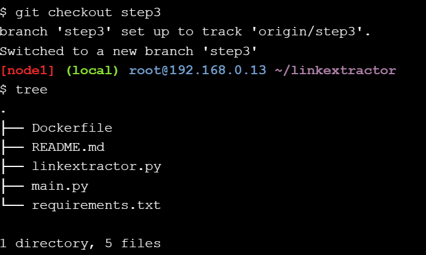

Build image yang ada dilist

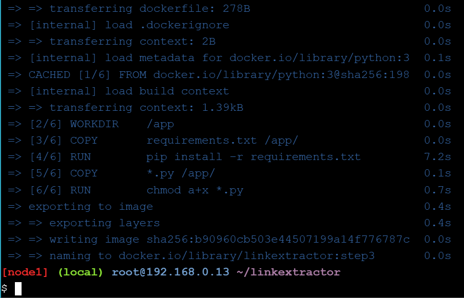

Cek kontainer yang baru saja dibuild dengan perintah `docker container ls`

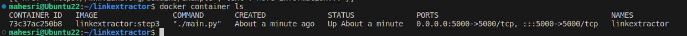

Membuat permintaan HTTP dalam bentuk /api/<url> untuk berbicara dengan server ini dan mengambil respons yang berisi tautan yang diekstrak dan didapati hasil output sebagai berikut:

```
HTTP/1.1 200 OK
Server: Werkzeug/3.0.1 Python/3.12.0
Date: Fri, 08 Dec 2023 19:10:00 GMT
Content-Type: application/json
Content-Length: 79
Connection: close

[{"href":"https://www.iana.org/domains/example","text":"More information..."}]
mahesri@Ubuntu22:~/linkextractor$ 
```

Melihat log kontainer linkextractor dengan perintah `docker container logs linkextractor`

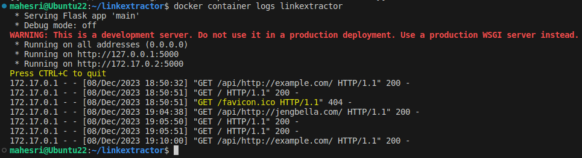

Catatan :

Perihtah log dapat mengetahui history /api/<url> yang sebelumnya digunakan.

Hapus kontainer linkextractor dengan perintah `docker container rm -f linkextractor`


## Step 4: Link Extractor API and Web Front End Services

Checkout repository step5 dan list repository tersebut

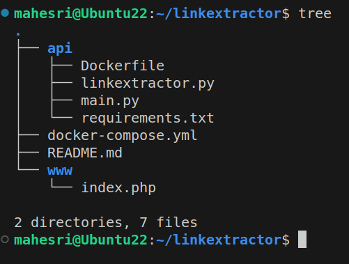

Catatan :

- Layanan API JSON ekstraktor tautan (ditulis dengan Python) dipindahkan ke folder `./api` terpisah yang memiliki kode yang sama persis seperti pada langkah sebelumnya
- Aplikasi front-end web ditulis dalam PHP di bawah `./www` folder yang berhubungan dengan API JSON
- Aplikasi PHP dipasang di dalam `php:7-apache` image Docker resmi untuk memudahkan modifikasi selama pengembangan
- Aplikasi web dapat diakses `dihttp://<hostname>[:<prt>]/?url=<url-encoded-url>`
- Variabel lingkungan `API_ENDPOINT` digunakan di dalam aplikasi PHP untuk mengonfigurasinya agar berkomunikasi dengan server API JSON
- File `docker-compose.yml` ditulis untuk membangun berbagai komponen dan menyatukannya

Pada langkah ini kami berencana menjalankan dua container terpisah, satu untuk API dan lainnya untuk antarmuka web. Yang terakhir memerlukan cara untuk berbicara dengan server API. Agar kedua container dapat berkomunikasi satu sama lain, kita dapat memetakan port mereka pada mesin host dan menggunakannya untuk perutean permintaan atau kita dapat menempatkan container dalam satu jaringan pribadi dan mengaksesnya secara langsung. Docker memiliki dukungan yang sangat baik untuk jaringan dan memberikan perintah yang berguna untuk menangani jaringan. Selain itu, dalam jaringan Docker, kontainer mengidentifikasi dirinya sendiri menggunakan namanya sebagai nama host untuk menghindari perburuan alamat IP mereka di jaringan pribadi. Namun, kami tidak akan melakukan semua ini secara manual, melainkan kami akan menggunakan Docker Compose untuk mengotomatiskan banyak tugas ini.

Buka konfigurasi Docker compose `docker-compose.yml` dan akan didapati output sebagai berikut 

```
version: '3'

services:
  api:
    image: linkextractor-api:step4-python
    build: ./api
    ports:
      - "5000:5000"
  web:
    image: php:7-apache
    ports:
      - "80:80"
    environment:
      - API_ENDPOINT=http://api:5000/api/
    volumes:
      - ./www:/var/www/html
```

Catatan :

 File YAML diatas adalah YAML sederhana yang menjelaskan dua layanan api dan web. Layanan api akan menggunakan gambar `linkextractor-api:step4-python` yang belum dibuat, namun akan dibuat berdasarkan permintaan menggunakan `Dockerfile` dari `./api` direktori. Layanan ini akan diekspos pada port `5000` host.

Layanan kedua bernama web akan menggunakan image resmi php:7-apache langsung dari DockerHub, itu sebabnya kami tidak memiliki Dockerfile untuk itu. Layanan akan diekspos pada port HTTP default (yaitu, 80). Kami akan menyediakan variabel lingkungan bernama `API_ENDPOINT` dengan nilai `http://api:5000/api/` untuk memberi tahu skrip PHP ke mana harus terhubung untuk akses API. Perhatikan bahwa kita tidak menggunakan alamat IP di sini, melainkan api:5000 digunakan karena kita akan memiliki entri nama host dinamis di jaringan pribadi untuk layanan API yang cocok dengan nama layanannya. Terakhir, kita akan mengikat folder ./www untuk membuat file index.php tersedia di dalam wadah layanan web di /var/www/html

Buka file php yang nantinya akan tampil sebagai front end dengan perintah `cat www/index.php` di CLI dan didapai output sebagai berikut 

```
<!DOCTYPE html>

<?php
  $api_endpoint = $_ENV["API_ENDPOINT"] ?: "http://localhost:5000/api/";
  $url = "";
  if(isset($_GET["url"]) && $_GET["url"] != "") {
    $url = $_GET["url"];
    $json = @file_get_contents($api_endpoint . $url);
    if($json == false) {
      $err = "Something is wrong with the URL: " . $url;
    } else {
      $links = json_decode($json, true);
      $domains = [];
      foreach($links as $link) {
        array_push($domains, parse_url($link["href"], PHP_URL_HOST));
      }
      $domainct = @array_count_values($domains);
      arsort($domainct);
    }
  }
?>

<html>
  <head>
    <meta charset="utf-8">
    <title>Link Extractor</title>
    <style media="screen">
      html {
        background: #EAE7D6;
        font-family: sans-serif;
      }
      body {
        margin: 0;
      }
      h1 {
        padding: 10px;
        margin: 0 auto;
        color: #EAE7D6;
        max-width: 600px;
      }
      h1 a {
        text-decoration: none;
        color: #EAE7D6;
      }
      h2 {
        background: #082E41;
        color: #EAE7D6;
        margin: -10px;
        padding: 10px;
      }
      p {
        margin: 25px 5px 5px;
      }
      section {
        max-width: 600px;
        margin: 10px auto;
        padding: 10px;
        border: 1px solid #082E41;
      }
      div.header {
        background: #082E41;
        margin: 0;
      }
      div.footer {
        background: #082E41;
        margin: 0;
        padding: 5px;
      }
      .footer p {
        margin: 0 auto;
        max-width: 600px;
        color: #EAE7D6;
        text-align: center;
      }
      .footer p a {
        color: #24C2CB;
        text-decoration: none;
      }
      .error {
        color: #DA2536;
      }
      form {
        display: flex;
      }
      input {
        font-size: 20px;
        padding: 3px;
        height: 40px;
      }
      input.text {
        box-sizing:border-box;
        flex-grow: 1;
        border-color: #082E41;
      }
      input.button {
        width: 150px;
        background: #082E41;
        border-color: #082E41;
        color: #EAE7D6;
      }
      table {
        width: 100%;
        text-align: left;
        margin-top: 10px;
      }
      table th, table td {
        padding: 3px;
      }
      table th:last-child, table td:last-child {
        width: 70px;
        text-align: right;
      }
      table th {
        border-top: 1px solid #082E41;
        border-bottom: 1px solid #082E41;
      }
      table tr:last-child td {
        border-top: 1px solid #082E41;
        border-bottom: 1px solid #082E41;
      }
    </style>
  </head>
  <body>
    <div class="header">
      <h1><a href="/">Link Extractor</a></h1>
    </div>

    <section>
      <form action="/">
        <input class="text" type="text" name="url" placeholder="http://example.com/" value="<?php echo $url; ?>">
        <input class="button" type="submit" value="Extract Links">
      </form>
    </section>
    
    <?php if(isset($err)): ?>
      <section>
        <h2>Error</h2>
        <p class="error"><?php echo $err; ?></p>
      </section>
    <?php endif; ?>

    <?php if($url != "" && !isset($err)): ?>
      <section>
        <h2>Summary</h2>
        <p>
          <strong>Page:</strong> <?php echo "<a href=\"" . $url . "\">" . $url . "</a>"; ?>
        </p>
        <table>
          <tr>
            <th>Domain</th>
            <th># Links</th>
          </tr>
          <?php
            foreach($domainct as $key => $value) {
              echo "<tr>";
              echo "<td>" . $key . "</td>";
              echo "<td>" . $value . "</td>";
              echo "</tr>";
            }
          ?>
          <tr>
            <td><strong>Total</strong></td>
            <td><strong><?php echo count($links); ?></strong></td>
          </tr>
        </table>
      </section>

      <section>
        <h2>Links</h2>
        <ul>
        <?php
          foreach($links as $link) {
            echo "<li><a href=\"" . $link["href"] . "\">" . $link["text"] . "</a></li>";
          }
        ?>
        </ul>
      </section>
    <?php endif; ?>

    <div class="footer">
      <p><a href="https://github.com/ibnesayeed/linkextractor">Link Extractor</a> by <a href="https://twitter.com/ibnesayeed">@ibnesayeed</a> from
        <a href="https://ws-dl.cs.odu.edu/">WS-DL, ODU</a>
      </p>
    </div>
  </body>
</html>
```

Catatan :

Variabel `$api_endpoint` diinisialisasi dengan nilai variabel lingkungan yang diberikan dari file `docker-compose.yml` sebagai `$_ENV["API_ENDPOINT"]` (jika tidak kembali ke nilai default `http://localhost:5000/api/`). Permintaan dibuat menggunakan fungsi file_get_contents yang menggunakan variabel $api_endpoint dan URL yang disediakan pengguna dari `$_GET["url"].` Beberapa analisis dan transformasi dilakukan pada respons yang diterima yang kemudian digunakan dalam markup untuk mengisi halaman.

Build Conatiner dengan perintah `docker-compose up -d --build` di CLI dan proses build apabila didapati sebuah output sebagai berikut di CLI

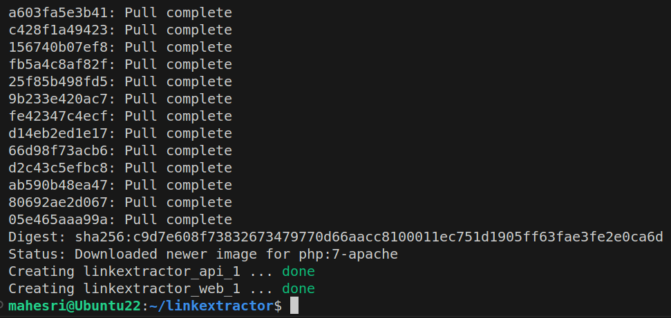

Cek di `localhost:80/` apakah tampilan yang smpat kita buka dengan perintah `cat www/index.php` dapat ditampilkan sebagaimana mestinya 

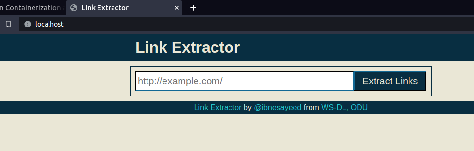

Cek apakah service dapat berjalan sebagaimana mestinya 

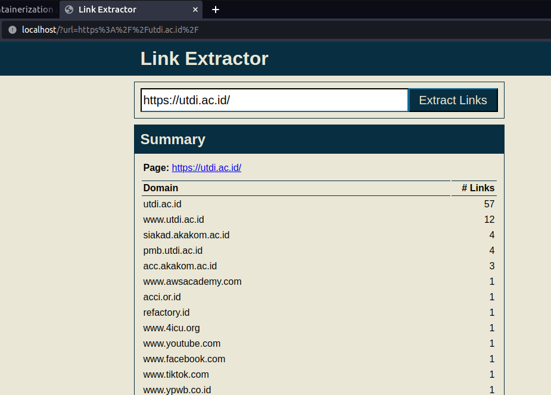

Memodifikasi `www/index.php` dengan perintah `sed -i 's/Link Extractor/Super Link Extractor/g' www/index.php` dan berikut tampilan headger setelah dimodifikasi 

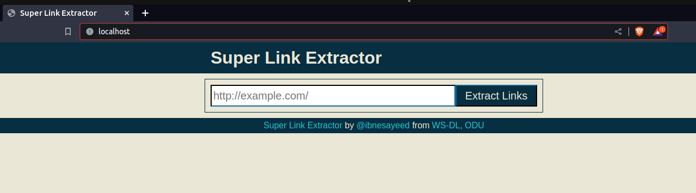

Reset git tracking dengan perintah `git reset --hard`

Shutdown Konatiner untuk mengehentikan service 

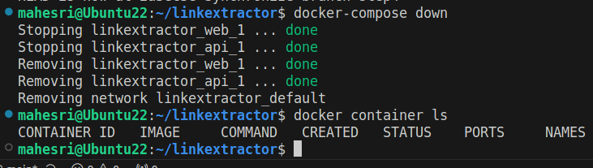

## Step 5: Redis Service for Caching

Checkout step5 dan list repository tersebut 

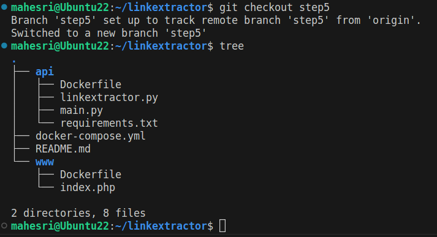

Buka Dockerfile dan didapati output sebagai berikut 

```
FROM       php:7-apache
LABEL      maintainer="Sawood Alam <@ibnesayeed>"

ENV        API_ENDPOINT="http://localhost:5000/api/"

COPY       . /var/www/html/
```

Buka main.py dan didapati output sebagai berikut 

```
redis_conn = redis.from_url(os.getenv("REDIS_URL", "redis://localhost:6379"))
# ...
    jsonlinks = redis.get(url)
    if not jsonlinks:
        links = extract_links(url)
        jsonlinks = json.dumps(links, indent=2)
        redis.set(url, jsonlinks)
```

Buka file konfigurasi `docker-compose.yml` dan didapati output sebagai berikut 

```
version: '3'

services:
  api:
    image: linkextractor-api:step5-python
    build: ./api
    ports:
      - "5000:5000"
    environment:
      - REDIS_URL=redis://redis:6379
  web:
    image: linkextractor-web:step5-php
    build: ./www
    ports:
      - "80:80"
    environment:
      - API_ENDPOINT=http://api:5000/api/
  redis:
    image: redis
```

Build compose dengan perintah `docker-compose up -d --build`.

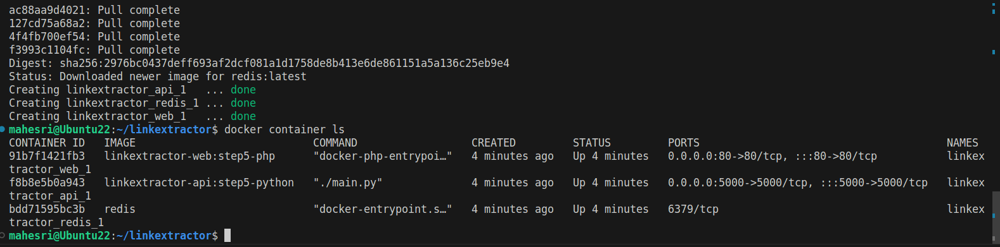

Masuk ke redis CLI monitor, dan apabila ingin keluar dari mode tersebut tekan `ctrl + C` 

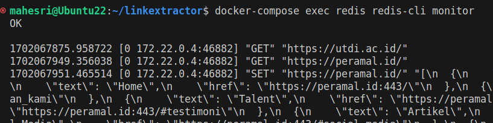

Matikan service dengan perintah `docker-compose down`

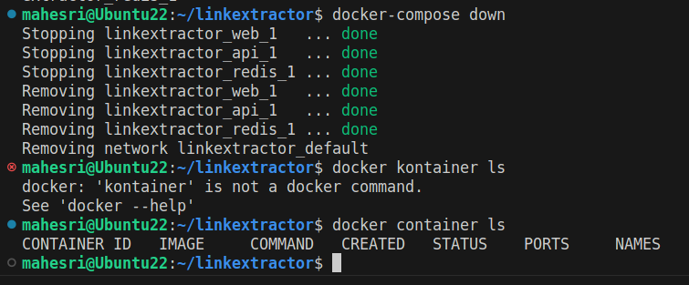

## Step 6: Swap Python API Service with Ruby

Checkout step6 dan list repository tersebut

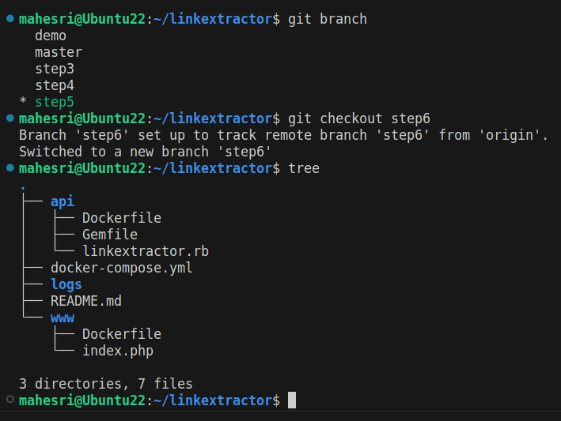

Buka file linkextractor.rb dengan perintah `cat api/linkextractor.rb` dan didapati output sebagai berikut 

```
#!/usr/bin/env ruby
# encoding: utf-8

require "sinatra"
require "open-uri"
require "uri"
require "nokogiri"
require "json"
require "redis"

set :protection, :except=>:path_traversal

redis = Redis.new(url: ENV["REDIS_URL"] || "redis://localhost:6379")

Dir.mkdir("logs") unless Dir.exist?("logs")

get "/" do
  "Usage: http://<hostname>[:<prt>]/api/<url>"
end

get "/api/*" do
  url = [params['splat'].first, request.query_string].reject(&:empty?).join("?")
  cache_status = "HIT"
  jsonlinks = redis.get(url)
  if jsonlinks.nil?
    cache_status = "MISS"
    jsonlinks = JSON.pretty_generate(extract_links(url))
    redis.set(url, jsonlinks)
  end

  cache_log = File.open("logs/extraction.log", "a")
  cache_log.puts "#{Time.now.to_i}\t#{cache_status}\t#{url}"
  cache_log.close

  status 200
  headers "content-type" => "application/json"
  body jsonlinks
end

def extract_links(url)
  links = []
  doc = Nokogiri::HTML(open(url))
  doc.css("a").each do |link|
    text = link.text.strip.split.join(" ")
    begin
      links.push({
        text: text.empty? ? "[IMG]" : text,
        href: URI.join(url, link["href"])
      })
    rescue
    end
  end
  links
end
```

Buka file Dockerfile dengan perintah `cat api/Dockerfile` dan didapati outputsebagai berikut 

```
FROM       ruby:2.6
LABEL      maintainer="Sawood Alam <@ibnesayeed>"

ENV        LANG C.UTF-8
ENV        REDIS_URL="redis://localhost:6379"

WORKDIR    /app
COPY       Gemfile /app/
RUN        bundle install

COPY       linkextractor.rb /app/
RUN        chmod a+x linkextractor.rb

CMD        ["./linkextractor.rb", "-o", "0.0.0.0"]
```

Buka file konfigurasi YAML dengan perintah `cat docker-compose.yml` dan didapati output sebagai berikut 

```
version: '3'

services:
  api:
    image: linkextractor-api:step6-ruby
    build: ./api
    ports:
      - "4567:4567"
    environment:
      - REDIS_URL=redis://redis:6379
    volumes:
      - ./logs:/app/logs
  web:
    image: linkextractor-web:step6-php
    build: ./www
    ports:
      - "80:80"
    environment:
      - API_ENDPOINT=http://api:4567/api/
  redis:
    image: redis
```

Build compose step6 dan didapati output sebagai berikut 

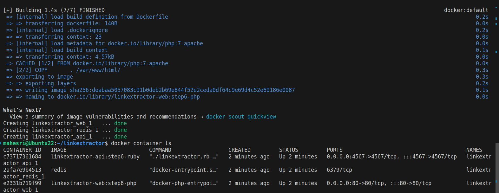

Mengetahui log service, meskipun service sudah dimatikan 

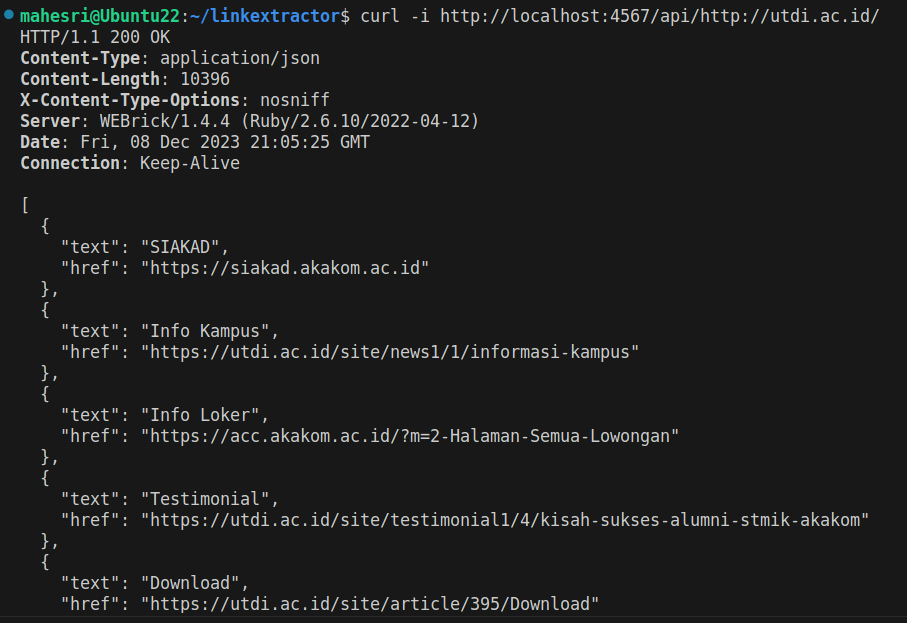

## Conclusion 

Kita memulai latihan ini dengan skrip Python sederhana yang mengambil link dari URL halaman web tertentu. Berbagai kesulitan kami tunjukkan dalam menjalankan naskah. Kami kemudian mengilustrasikan betapa mudahnya menjalankan dan membawa skrip setelah dimasukkan ke dalam container. Pada langkah selanjutnya kami secara bertahap mengembangkan skrip menjadi tumpukan aplikasi multi-layanan. Dalam prosesnya, kami mengeksplorasi berbagai konsep arsitektur layanan mikro dan bagaimana alat Docker dapat membantu dalam mengatur tumpukan multi-layanan. Terakhir, kami mendemonstrasikan kemudahan pertukaran komponen layanan mikro dan persistensi data.

