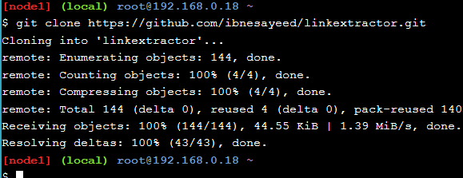
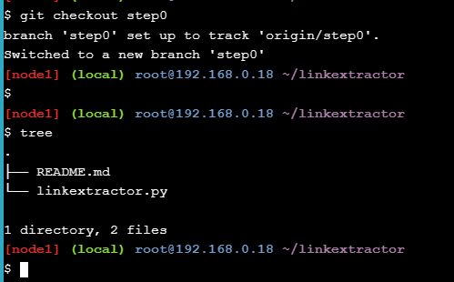
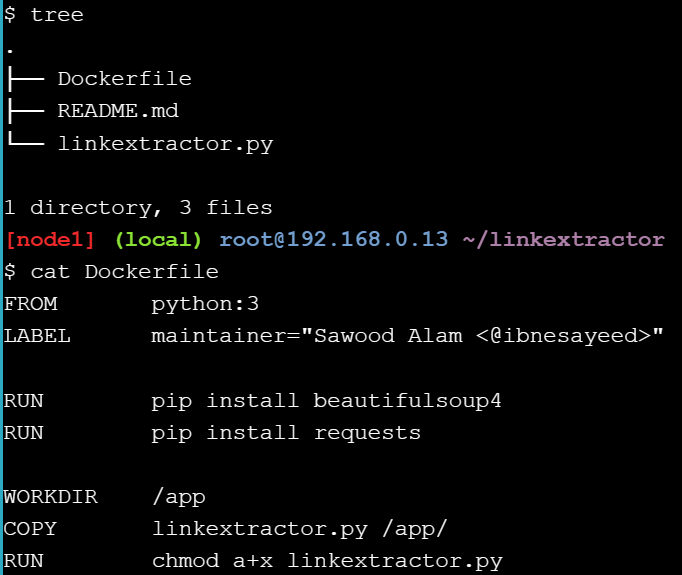
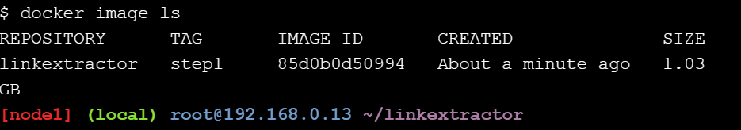
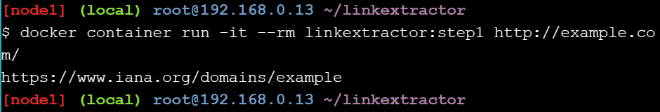
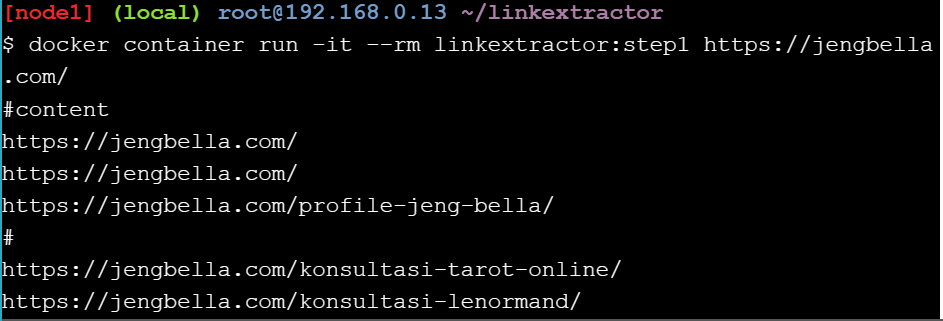
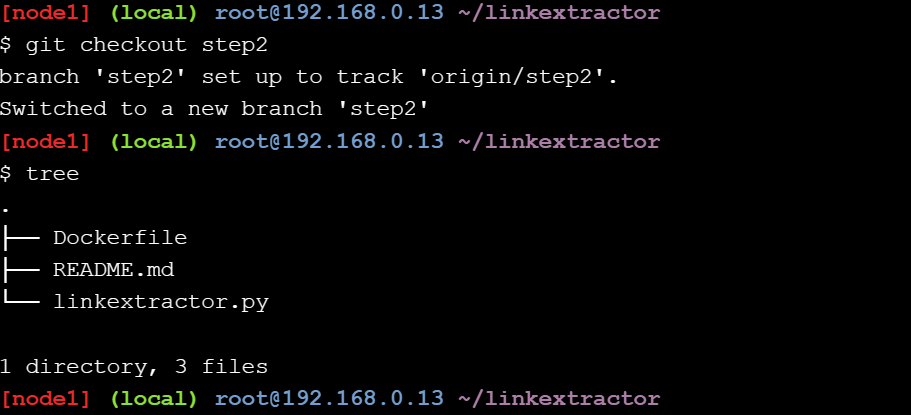
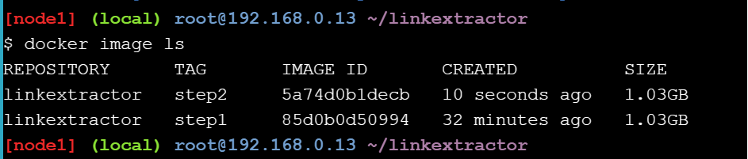

# Application Containerization and Microservice Orchestration

## Stage Setup

Cloning Demo repository 



Masuk ke directory linkextractor dengan mengetikan ` cd linkextractor` di command line interface (CLI) Play With Docker, setelah itu switching repositori ke demo dengan mengetikan perintah `git checkout demo` di CLI.

## Step 0: Basic Link Extractor Script

Checkout `step0` branch dan list isi directory tersebut 



Buka file linkextractor yang ada di list dengan perintah `cat linkextractor.py` dan akan didapati output sebagai berikut :
```
#!/usr/bin/env python

import sys
import requests
from bs4 import BeautifulSoup

res = requests.get(sys.argv[-1])
soup = BeautifulSoup(res.text, "html.parser")
for link in soup.find_all("a"):
    print(link.get("href"))
```

Catatan :
Dalam dalam file `linkextractor`, terdapat scrip phyton sederhana untuk mengimpor tiga paket : sys dari pustaka standar dan dua paket pihak ketiga populer, yaitu requests dan bs4. Argumen baris perintah yang disediakan oleh pengguna (yang diharapkan berupa URL ke halaman HTML) digunakan untuk mengambil halaman menggunakan paket requests, kemudian diparsing menggunakan BeautifulSoup. Objek yang diparsing kemudian diiterasi untuk menemukan semua elemen anchor (yaitu, tag <a>) dan mencetak nilai atribut href yang berisi hyperlink. 

Mencoba menjalankan aplikasi dan mengecek apakah script dapat dijalankan.


Menjalankan script linkextractor sebagai program python dengan mengetikan perintah `python3 linkextractor.py` di CLI dan akan didapai output error sebagai berikut .

```
Traceback (most recent call last):
  File "/root/linkextractor/linkextractor.py", line 4, in <module>
    import requests
ModuleNotFoundError: No module named 'requests'
```

Catatan :
Error tersebut mengindikasikan tentang bebrapa komponen yang belum tersedia didalam host play with Docker, yang mana dalam langkah berikutnya program akan
[di-containerize](https://www.redhat.com/en/topics/cloud-native-apps/what-is-containerization) dengan container Docker untuk memudahkan program tersebut di execute.

## Step 1: Containerized Link Extractor Script

Checkout drictory `step1` dan buka file Docker yang ada dalam directory tersebut



Build image dengan perintah `docker image build -t linkextractor:step1 .` secara otomatis, dengan menggunakan Dockerfile yang ad di list step1 kita dapat menyiapkan image Docker untuk skrip yang tadi sempat gagal di step sebelumnya. Mulai dari image python Docker resmi yang berisi run-time Python environment serta tools yang diperlukan untuk menginstal paket dan dependensi Python.

Mengecek docker image di host dengan perintah `docker image ls`



Jalankan kontainer dengan perintah `docker container run -it --rm linkextractor:step1 http://example.com/` dan akan didapati output sebagai berikut 



Mencoba dalam webpage lain



## Step 2: Link Extractor Module with Full URI and Anchor Text

Checkout ke repositori `step2`



Jalankan Docker yang ada di list dengan perintah `docker image build -t linkextractor:step2 .` dan cek apakah sudah ter-build dengan benar 



