# Hello Minikube

Dalam praktikum ini akan belajar menjalankan contoh aplikasi di Kubernetes menggunakan minikube. Dan didalam modul praktikum ini juga disedaikan image container yang menggunakan NGINX untuk mengembalikan semua permintaan.

Start minikube

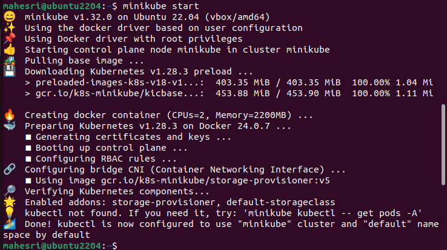

Buka dashboard minikube dengan mengetikan `minikube dashboard --url` dan copy-kan url didalam output.

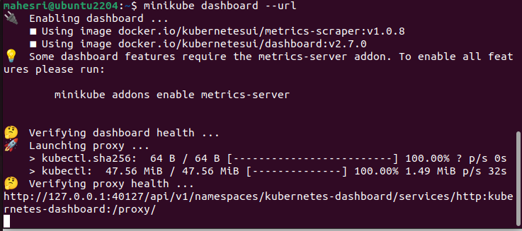

Buka browser dan Paste-kan url ditab baru.

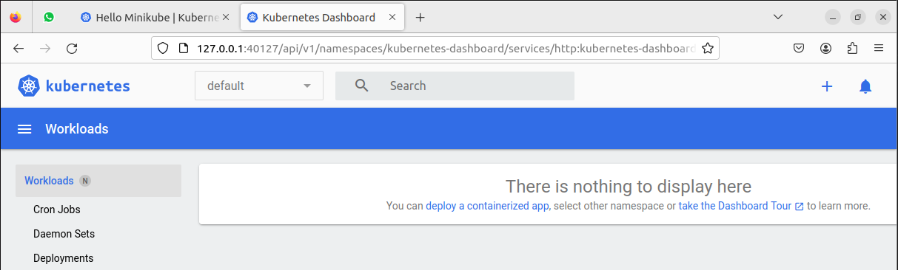

Install kubectl 

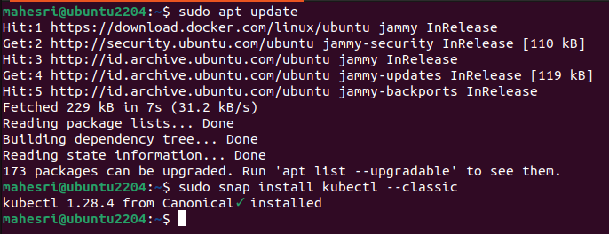

Membuat Deployment untuk me-manages Pod

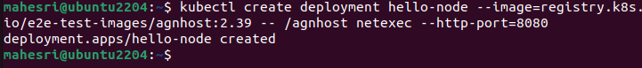

Lihat Deployment 

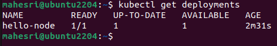

View the Pods

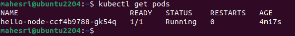

View Cluster Event

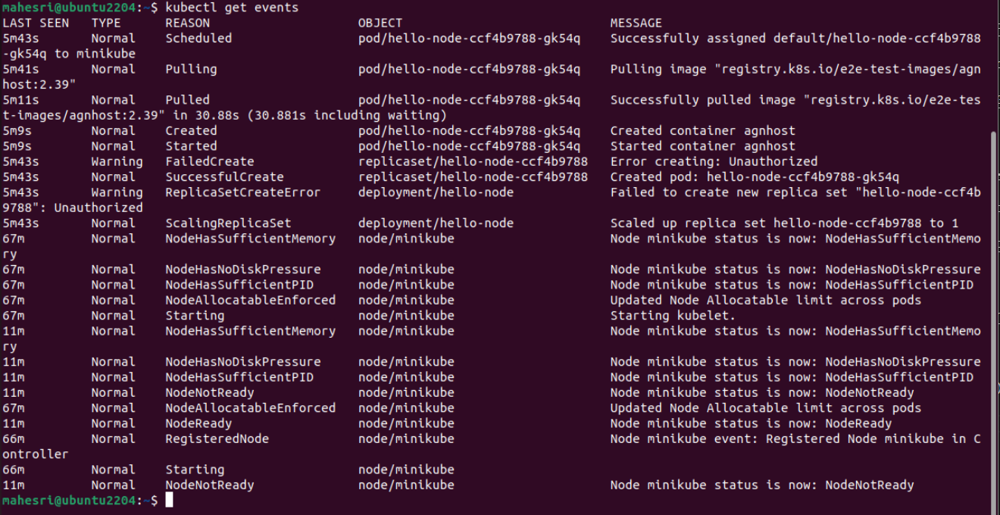

## Create Service 

Publish Pod ke internet

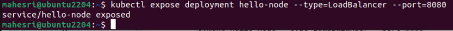

View the Service

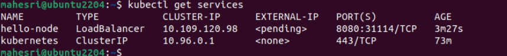

Run the following command

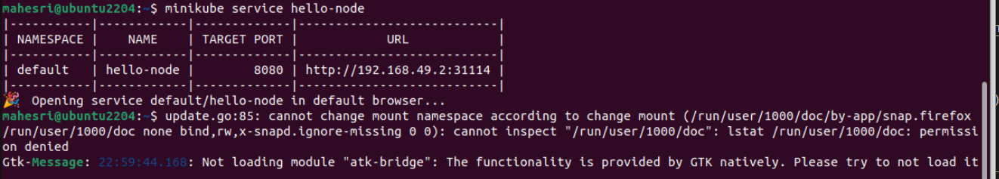

## Enable addons 

View minikube addon

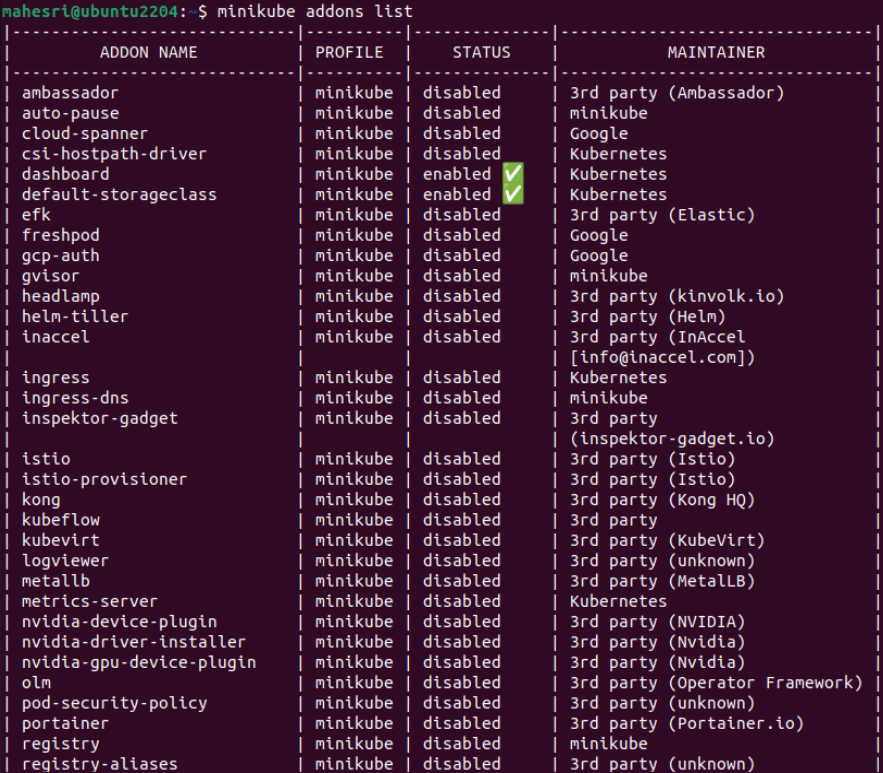

Enable addon metrics-server

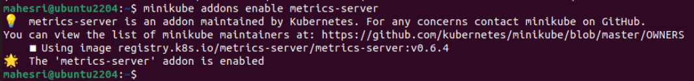

Installing addon

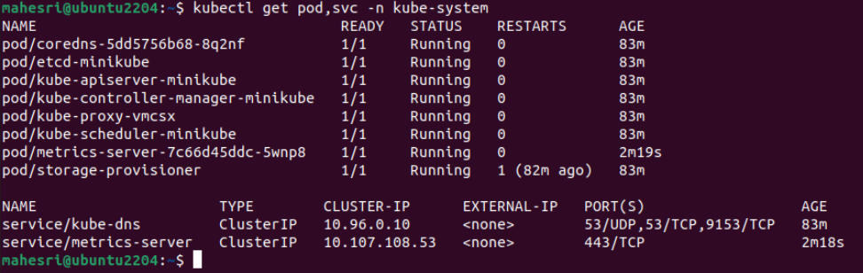

## CLEANUP

Ketikan perintah berikut :

```
kubectl delete service hello-node
kubectl delete deployment hello-node
minikube stop
```